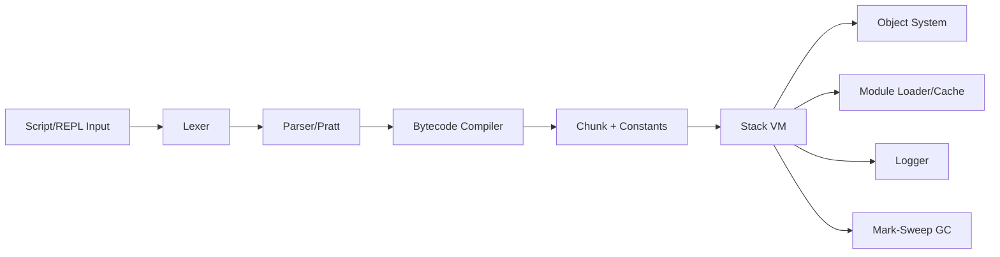
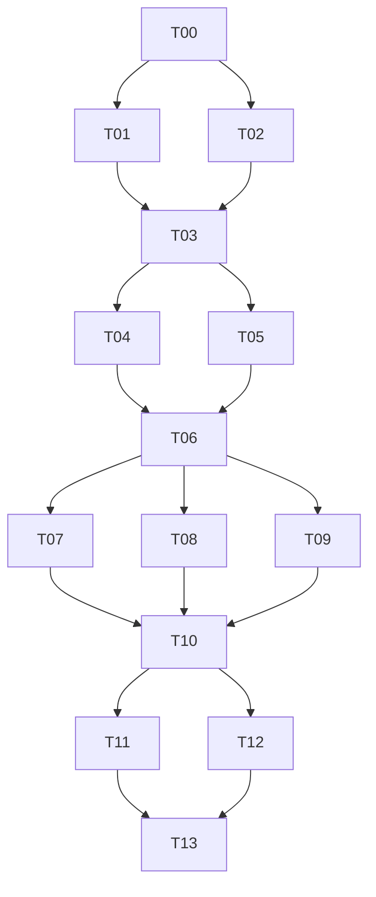

# Requirements.md

## 1. Background and Goal

Maple is a C++23+ scripting runtime inspired by the clox track in Crafting Interpreters.
Goal: build a modern, testable, cross-platform runtime (Windows/MSVC, Linux/GCC) that preserves clox core semantics/execution and adds module imports (`import` and `from ... import ... as ...`).

Goals:
1. Full bytecode compilation and stack-VM execution.
2. Practical garbage collection (GC) with complex object-graph and closure-lifecycle support.
3. Module system and import-semantic extensions.
4. Internal colorized, leveled logging.
5. Clear multi-file project layout, CMake build system, and isolated test directories.

## 2. Scope

### 2.1 In Scope

1. End-to-end pipeline: lexing, parsing, bytecode generation, and VM execution.
2. clox-equivalent core language: expressions, statements, control flow, functions, closures, classes/inheritance, method calls, and native-function bridge.
3. GC (at least mark-sweep with root-set tracing).
4. Maple module system (`import` and `from ... import ... as ...`).
5. REPL and script-file execution modes.
6. Cross-platform build/test baseline (MSVC/GCC).
7. Built-in logger (levels, colors, configurable behavior).

### 2.2 Out of Scope

1. JIT/AOT compilation.
2. Multi-threaded VM and concurrent GC.
3. Package manager and remote module registry.
4. GUI debugger.
5. Full Python/JS semantic compatibility.

## 3. Functional Requirements (by Priority)

### 3.1 P0 (Required for v1)

1. Core language: variables, scopes, conditions, loops, functions, closures, classes, inheritance, method binding.
2. Bytecode and VM: instruction execution, call frames, stack management, runtime error reporting.
3. GC: allocation tracking, reachability marking, sweep reclamation, string interning support.
4. File execution and REPL.
5. `import module`: module loading, caching, one-time initialization.
6. `from module import name as alias`: symbol import and alias binding.
7. Logger: `TRACE/DEBUG/INFO/WARN/ERROR/FATAL` levels and color mapping.
8. Cross-platform CMake build plus baseline tests.

### 3.2 P1 (Post-v1 Enhancements)

1. Explicit diagnostics for module cycles and improved partial-initialization strategy.
2. More precise error location (file/line/column/call stack).
3. Configurable GC thresholds and debug statistics output.
4. Unified snapshot and regression test toolchain.

### 3.3 P2 (Evolution Direction)

1. Bytecode optimization (constant folding, peephole optimization).
2. Incremental-GC pre-research interfaces.
3. Pluggable module loader.

## 4. Non-Functional Requirements

1. Portability: build/run on Windows 10+/11 + MSVC (19.3x+) and Linux + GCC (13+).
2. Maintainability: modular multi-file layout, `.hh/.cc` split, unified `namespace ms`.
3. Observability: log levels/filtering and key-path instrumentation (compile/execute/GC/module load).
4. Performance: maintain linearly scalable behavior while preserving teaching-oriented readability.
5. Stability: invalid scripts must not crash the host process (except unrecoverable errors).

## 5. Import Semantics (Precise Definition)

1. `import foo.bar`
- Resolve `foo.bar` as a canonical module identifier (mappable to file paths).
- On first import, execute module top-level code and cache the module object.
- On repeated import, return cache without re-execution.

2. `from foo.bar import baz as qux`
- Validate that `baz` exists during import.
- Bind `baz` into current scope as `qux`.
- If `as` is omitted, bind with the original name.

3. Errors
- Module-not-found, symbol-not-found, and cycle-caused uninitialized access must report explicit error kind and location.

## 6. Test Requirements

1. Keep tests under an isolated `tests/` directory.
2. Coverage: lexer/parser/compiler unit tests, VM instruction behavior, GC lifecycle, module import semantics and failure paths, REPL/CLI integration, and cross-platform smoke tests.
3. Test scripts must cover normal, boundary, error, and regression flows.

## 7. Milestones and Acceptance (DoD)

| Milestone | Deliverables | Acceptance Criteria |
|---|---|---|
| M1 | Basic frontend + bytecode + VM | Basic statement/function tests pass |
| M2 | Closure/class/inheritance + GC | Object lifecycle and closure tests pass |
| M3 | Module system | Module cache, alias import, and error-path tests pass |
| M4 | Logger + cross-platform build + test completion | Windows/Linux CI passes |

---

# Design.md

## 1. Overall Architecture



## 2. Key Design Decisions

1. Separate compile-time and runtime responsibilities to reduce coupling.
2. Use clox-style single-pass compilation (Pratt + direct bytecode emission); v1 does not strictly depend on a complete AST.
3. Use mark-sweep for the initial GC.
4. Use source-level on-demand load/compile/execute for v1 modules and add module caching.
5. Use a lightweight logger API with platform adapters (ANSI/Windows console).

## 3. Recommended Directory Layout

```text
Maple/
  CMakeLists.txt
  cmake/
  src/
    main.cc
    cli/
      app.hh
      app.cc
    frontend/
      token.hh
      lexer.hh
      lexer.cc
      parser.hh
      parser.cc
      compiler.hh
      compiler.cc
    bytecode/
      opcode.hh
      chunk.hh
      chunk.cc
      disasm.hh
      disasm.cc
    runtime/
      value.hh
      object.hh
      object.cc
      table.hh
      table.cc
      vm.hh
      vm.cc
      gc.hh
      gc.cc
      module.hh
      module.cc
    support/
      logger.hh
      logger.cc
      source.hh
      source.cc
  tests/
    unit/
    integration/
    scripts/
      language/
      gc/
      module/
      cli/
```

---

# Task Decomposition (Multi-Agent Ready)

## 1. Decomposition Principles

1. Each task must have one target, independent delivery, testability, and verifiability.
2. Each task must define inputs, outputs, dependencies, and acceptance criteria.
3. Support parallel work via explicit parallel groups.
4. Each task should be executable by an independent agent/subagent with minimal cross-file coupling.
5. Build skeleton first, then add features; infrastructure tasks come first.

## 2. Task Overview and Dependency Graph



## 3. Task List (Executable, Testable, Verifiable)

### T00 - Project Bootstrap and Constraint Setup (P0)

- Goal: establish CMake skeleton and directory layout; lock C++23, namespace constraints, and file-suffix conventions.
- Status: completed (2026-03-08)
- Inputs: PLAN.md, AGENTS.md.
- Outputs:
  - `CMakeLists.txt`
  - base directories: `src/`, `tests/`, `cmake/`
  - minimal compilable empty targets (`maple_core`, `maple_cli`)
- Depends On: none
- Parallel Group: G0
- Test:
  - CMake configure succeeds
  - empty program builds
- Verify:
  - `cmake -S . -B build`
  - `cmake --build build`
- DoD:
  - baseline build passes on both Windows/Linux.

### T01 - Logging System (P0)

- Goal: implement logger levels, formatting, color mapping, and platform-adapter interfaces.
- Status: completed (2026-03-08, subagent-A)
- Inputs: T00 skeleton.
- Outputs:
  - `src/support/logger.hh/.cc`
  - log-level configuration entry
- Depends On: T00
- Parallel Group: G1
- Test:
  - unit tests: level filtering, formatting, color toggle
- Verify:
  - run logger tests and manually verify color output
- DoD:
  - TRACE/DEBUG/INFO/WARN/ERROR/FATAL all emit and filter correctly.

### T02 - Source File and Error-Location Infrastructure (P0)

- Goal: implement source loading, line/column mapping, and unified error-location data structures.
- Status: completed (2026-03-08, subagent-A)
- Outputs:
  - `src/support/source.hh/.cc`
  - unified error-location data structure
- Depends On: T00
- Parallel Group: G1
- Test:
  - line/column mapping unit tests
  - file-read error-path unit tests
- Verify:
  - tests cover normal/abnormal reads

### T03 - Bytecode Container and Disassembler (P0)

- Goal: land opcode definitions, chunk constant pool, line table, and disassembler.
- Status: completed (2026-03-08, subagent-A)
- Outputs:
  - `src/bytecode/opcode.hh`
  - `src/bytecode/chunk.hh/.cc`
  - `src/bytecode/disasm.hh/.cc`
- Depends On: T01, T02
- Parallel Group: G2
- Test:
  - instruction write/read consistency
  - constant-pool index boundary tests
  - disassembly snapshot tests
- Verify:
  - fixed chunks generate stable disassembly text

### T04 - Lexer (P0)

- Goal: complete token definitions and lexer (keywords, strings, numbers, comments).
- Status: completed (2026-03-08, subagent-B)
- Outputs:
  - `src/frontend/token.hh`
  - `src/frontend/lexer.hh/.cc`
- Depends On: T03
- Parallel Group: G3
- Test:
  - token golden tests (valid and invalid input)
- Verify:
  - `tests/unit/frontend/lexer_*`

### T05 - Value Type and Object-System Foundation (P0)

- Goal: build base `Value`/`Obj` and string-object/hash-table foundations.
- Status: completed (2026-03-08, subagent-C)
- Outputs:
  - `src/runtime/value.hh`
  - `src/runtime/object.hh/.cc`
  - `src/runtime/table.hh/.cc`
- Depends On: T03
- Parallel Group: G3
- Test:
  - `Value` type checks and comparisons
  - string interning and hash-table read/write
- Verify:
  - unit tests cover object create/find/intern-reuse

### T06 - Minimal VM Loop Closure (P0)

- Goal: implement minimal instruction execution (constant, arithmetic, compare, jump, print, return) and call-stack basis.
- Status: completed (2026-03-08, subagent-C)
- Outputs:
  - `src/runtime/vm.hh/.cc`
- Depends On: T04, T05
- Parallel Group: G4
- Test:
  - instruction-level unit tests
  - small-script integration tests (expression/branch/loop)
- Verify:
  - script exit codes and outputs match expectations

### T07 - Parser (Pratt) and Expression Compilation (P0)

- Goal: parser + compiler generate bytecode for expressions and basic statements.
- Status: completed (2026-03-08, subagent-B)
- Outputs:
  - `src/frontend/parser.hh/.cc`
  - `src/frontend/compiler.hh/.cc`
- Depends On: T06
- Parallel Group: G5
- Test:
  - compiled-bytecode snapshots
  - syntax-error diagnostic tests
- Verify:
  - fixed scripts produce fixed disassembly output

### T08 - Function/Closure/Upvalue (P0)

- Goal: implement function objects, call frames, closure capture, and upvalue lifecycle.
- Status: completed (2026-03-08, clox-full-semantics-upgrade, closure-batch)
- Current State:
  - minimal runnable bridge (baseline bridge) is done, but full clox closure semantics were pending at that point.
  - 2026-03-08: lexical/runtime object carriers were added: `fun/return/class/this/super` tokens wired into lexer; `Value` now holds generic runtime objects (`RuntimeObject`) as storage channel for closure/class object-model integration.
- Design & Implementation Tasks:
  - `T08-D1` complete object model: `ObjFunction / ObjClosure / ObjUpvalue`, function prototypes, constant-pool and closure-object relations.
  - `T08-D2` complete compiler semantics: local resolution, upvalue resolution (recursive outer capture), function declarations/lambdas, scope-depth and escaping-variable management.
  - `T08-D3` complete VM execution chain: `OP_CALL`, `OP_CLOSURE`, `OP_GET_UPVALUE`, `OP_SET_UPVALUE`, `OP_CLOSE_UPVALUE`, `OP_RETURN`, and call-frame windows.
  - `T08-D4` runtime consistency: recursion, closure write-back, loop capture, post-return upvalue liveness, stack tracing and message formats.
  - `T08-D5` test matrix: closure golden scripts, recursion/higher-order functions, boundary errors (arity, undefined variables, invalid call), and regression set.
- Outputs:
  - `src/runtime/object.hh/.cc` (function/closure/upvalue objects)
  - `src/runtime/vm.hh/.cc` (call-frame + upvalue lifecycle)
  - `src/frontend/compiler.hh/.cc` (closure compilation path)
  - `tests/scripts/language/closure_*`
  - `tests/integration/closure_*`
- Depends On: T06
- Parallel Group: G5
- Test:
  - closure capture semantics tests (read/write)
  - recursion and higher-order function tests
  - upvalue-close timing tests (still accessible after leaving scope)
- Verify:
  - behavior matches clox Chapter 24~26 analogs (output and error paths).

### T09 - Class/Inheritance/Method Binding (P0)

- Goal: implement class, instance, method, and super-call chains.
- Status: completed (2026-03-08, clox-full-semantics-upgrade, class-inheritance-batch)
- Current State:
  - minimal runnable bridge (baseline bridge) is done, but full clox class/inheritance semantics were pending at that point.
  - 2026-03-08: class-semantic prerequisites were added: class syntax tokens and object-value channel; this enabled later `ObjClass/ObjInstance/ObjBoundMethod` and dispatch-chain landing without breaking `Value` ABI.
- Design & Implementation Tasks:
  - `T09-D1` complete object model: `ObjClass / ObjInstance / ObjBoundMethod`, field-table and method-table layouts.
  - `T09-D2` complete compiler semantics: `class` declarations, method compilation, `this` binding rules, `super` resolution and inheritance constraints (forbid self-inheritance).
  - `T09-D3` complete VM op chain: `OP_CLASS`, `OP_INHERIT`, `OP_METHOD`, `OP_GET_PROPERTY`, `OP_SET_PROPERTY`, `OP_GET_SUPER`, `OP_INVOKE`, `OP_SUPER_INVOKE`.
  - `T09-D4` runtime consistency: `init` constructor behavior, method dispatch, bound-method object lifecycle, and field shadow/override resolution order.
  - `T09-D5` test matrix: class definition/instance fields/method calls/inheritance override/`super` chain/error-path regressions.
- Outputs:
  - `src/runtime/object.hh/.cc` (class/instance/bound-method objects)
  - `src/runtime/vm.hh/.cc` (property access and call dispatch)
  - `src/frontend/compiler.hh/.cc` (class/this/super compilation path)
  - `tests/scripts/language/class_*`
  - `tests/integration/class_*`
- Depends On: T06
- Parallel Group: G5
- Test:
  - class definition, field read/write, method call, inheritance override tests
  - `this`/`super` semantics and error-path tests
- Verify:
  - behavior matches clox Chapter 27~29 analogs (output and error paths).

### T10 - GC (mark-sweep) Integration (P0)

- Goal: complete GC root scan, mark, sweep, trigger thresholds, and statistics logs.
- Status: completed (2026-03-08, subagent-C)
- Outputs:
  - `src/runtime/gc.hh/.cc`
  - VM/object-system GC hook integration
- Depends On: T07, T08, T09
- Parallel Group: G6
- Test:
  - stress allocation/reclamation tests
  - closure/class/string liveness tests during collection
  - regression: no dangling references
- Verify:
  - GC log stats and object-count changes match expectations

### T11 - Module System: import (P0)

- Goal: support `import module`, including path resolution, loading, compile/execute, and cache.
- Status: completed (2026-03-08, subagent-D)
- Outputs:
  - `src/runtime/module.hh/.cc`
  - compiler and VM import instruction/call paths
- Depends On: T10
- Parallel Group: G7
- Test:
  - first import execution and repeated import cache reuse
  - module-not-found errors
- Verify:
  - module top-level side effects execute once

### T12 - Module System: from import as (P0)

- Goal: support `from a.b import x as y` semantics and error handling.
- Status: completed (2026-03-08, subagent-D)
- Outputs:
  - parser/compiler/module/vm corresponding extensions
- Depends On: T10
- Parallel Group: G7
- Test:
  - imported-symbol binding and alias binding
  - symbol-not-found errors
  - uninitialized-access errors in cyclic dependencies
- Verify:
  - all semantic script assertions pass

### T13 - CLI/REPL + Test Assembly + Cross-Platform CI (P0)

- Goal: fully deliver entry program, test directories, ctest integration, and cross-platform verification scripts.
- Status: completed (2026-03-08, subagent-D)
- Outputs:
  - `src/main.cc`, `src/cli/app.hh/.cc`
  - `tests/unit`, `tests/integration`, `tests/scripts`
  - `CTest` configuration and minimal CI scripts
- Depends On: T11, T12
- Parallel Group: G8
- Test:
  - CLI argument tests
  - REPL basic interaction tests
  - end-to-end script tests
- Verify:
  - `ctest --output-on-failure` passes
  - Windows/Linux builds and tests both pass

## 4. Subtask Template (Reusable Across Agents)

Each sub-agent must submit results with this template:

1. Task ID
2. Changed files list
3. Behavior-change summary
4. Added/updated tests
5. Local verification commands and results
6. Risks and follow-up recommendations

## 5. Parallel Execution Recommendations (Agent Orchestration)

1. Wave 1: `T00`
2. Wave 2: `T01 + T02` (parallel)
3. Wave 3: `T03`
4. Wave 4: `T04 + T05` (parallel)
5. Wave 5: `T06`
6. Wave 6: `T07 + T08 + T09` (baseline)
7. Wave 6R: `T08-D1~D5 + T09-D1~D5` (clox full-semantics upgrade)
8. Wave 7: `T10`
9. Wave 8: `T11 + T12` (parallel)
10. Wave 9: `T13`

## 6. Acceptance Matrix (Task -> Verifiable Artifacts)

| Task | Executable | Testable | Verifiable |
|---|---|---|---|
| T00 | CMake buildable | build smoke test | configure/build commands succeed |
| T01 | logger demo | unit tests | level filtering and color output |
| T02 | source loader demo | unit tests | accurate error location |
| T03 | chunk/disasm demo | unit + snapshot | stable disassembly |
| T04 | lexer CLI | unit + golden | token sequence consistency |
| T05 | object/table demo | unit tests | stable interning and hash behavior |
| T06 | VM demo | instruction integration | script output matches |
| T07 | compile demo | compile snapshot | bytecode consistency |
| T08 | closure demo | integration tests | correct capture semantics |
| T09 | class demo | integration tests | correct inheritance/method resolution |
| T10 | GC stress demo | stress + regression | no leaks/dangling refs (test-defined) |
| T11 | import demo | integration tests | cache reuse and one-time init |
| T12 | from-import-as demo | integration tests | alias binding and correct error paths |
| T13 | CLI/REPL executable | full test suite | ctest + dual-platform pass |

## 7. Branch and Commit Strategy (Multi-Agent)

1. Use one branch per task: `task/Txx-short-name`.
2. Each task should have at least one pair of commits: feature + test (or one atomic commit).
3. Commit messages must be English and include gitmoji (per AGENTS.md).
4. Merge strictly by dependency graph, bottom-up.

## 8. Risk Control Points (Execution)

1. Define T08/T09 and T10 interface freeze points early (avoid GC-integration rework).
2. Run T11/T12 in parallel only after parser syntax and VM op-layer alignment.
3. If any task changes shared object layout, trigger affected task regression tests.

## 9. Full Delivery Criteria

PLAN is implementable and verifiable when all conditions are met:

1. T00-T13 are complete and pass defined tests, and T08/T09 reach full clox semantics (closures + class inheritance).
2. `tests` is layered into unit, integration, and script tests.
3. `import` and `from ... import ... as ...` cover both normal and error paths.
4. VM + GC + logger + cross-platform builds all have reproducible evidence.

## 2026-03-08 Incremental Update
- T08 status: completed (closure batch, D1~D5).
- T09 status: completed (class/inheritance batch).
- Verification: cmake --build build --config Debug; ctest --test-dir build --output-on-failure -C Debug.

- 2026-03-08 update: T09 class/inheritance batch completed with class_* integration scripts and tests.

---

## 2026-03-08 Language Professionalization Iteration Plan (Planning Only)

### A. Current Implementation Assessment (Expert Review)

- Runtime architecture is currently **dual-path**:
  - `Vm::Execute` runs a minimal bytecode instruction set.
  - `Vm::ExecuteSource` routes to `ScriptInterpreter` (tree-walk style with its own AST/parser/evaluator).
  - This causes semantic drift risk and makes long-term optimization and correctness harder.
- Frontend grammar is **not yet a full formal language grammar**:
  - Token set and parser are still subset-level.
  - Missing full operator lattice (`==`, `!=`, `>`, `>=`, logical `and/or`, etc.) and structured control flow (`if/else`, `while`, `for`, `break`, `continue`).
- Semantic analysis is runtime-only for many rules:
  - No resolver pass for lexical binding depth.
  - `this/super` misuse is mostly diagnosed at runtime, not compile-time.
- Object/value model is still transitional:
  - `Value` is variant-based and mixes module/object primitives pragmatically.
  - No finalized language-level object protocol and identity/equality model doc.
- GC is currently threshold-counter behavior, not production tracing GC.
- Module system works functionally, but language-level contract is under-specified:
  - Export surface, visibility, and initialization contract need a formal definition.
- Diagnostics and conformance are still engineering-oriented, not language-standard oriented:
  - Error metadata (span, phase, code) and compatibility suite are insufficient for a 鈥渇ormal language鈥?baseline.

### B. Iteration Goal (Professional/Formal Language Baseline)

Define Maple as a spec-driven language runtime with:

1. Single canonical execution semantics (bytecode VM as source of truth).
2. Versioned language specification (lexical/syntax/static semantics/runtime semantics).
3. Deterministic diagnostics model (phase + span + stable message contract).
4. Formal module boundary contract and testable conformance suite.
5. Traceable release gates from feature design -> implementation -> verification.

### C. New Task Set (Planning Only)

#### T14 - Language Specification v0.1 (P0)
- Goal: produce first formal spec package and freeze baseline semantics.
- Status: draft completed (2026-03-08, docs-only; no runtime/compiler implementation changes)
- Deliverables:
  - `docs/spec/lexical.md` (tokens, literals, comments, escapes, reserved words)
  - `docs/spec/grammar.ebnf` (complete grammar baseline)
  - `docs/spec/semantics.md` (scope, closures, class/super, modules, truthiness, equality)
  - `docs/spec/errors.md` (error taxonomy and diagnostic shape)
- Acceptance:
  - Every implemented syntax/semantic behavior maps to an explicit spec section.
  - Ambiguities are listed as explicit TBD items (not implicit behavior).
- Draft Completion Notes (2026-03-08):
  - Added draft files:
    - `docs/spec/lexical.md`
    - `docs/spec/grammar.ebnf`
    - `docs/spec/semantics.md`
    - `docs/spec/errors.md`
  - Scope of completion:
    - Specification draft is complete for v0.1 planning.
    - No compiler/VM/interpreter behavior was changed in this step.

##### T14-GAP - Spec vs Implementation Delta (to be closed by T15/T16/T20)

- `GAP-01` Execution-path divergence:
  - Spec assumes unified normative semantics; current runtime uses dual-path (`Vm::Execute` vs `ScriptInterpreter`).
  - Status: closed (2026-03-08, W10)
  - Evidence:
    - `Vm::ExecuteSource` now routes compile+bytecode+VM first.
    - legacy interpreter kept only under explicit mode gate (`kLegacyOnly` / compatibility fallback).
- `GAP-02` Grammar overhang:
  - Spec includes logical/comparison/control-flow grammar not fully present in current parser/compiler/interpreter path.
- `GAP-03` Static semantic phase missing:
  - Spec defines resolve-phase errors (`return/this/super` context rules); implementation is mostly runtime-checked.
  - Status: closed (2026-03-08, W11)
  - Evidence:
    - `ScriptInterpreter::Execute` now runs resolver before execution and blocks run on resolve diagnostics.
    - `MS3001/MS3002/MS3003/MS3004` violations are emitted as resolve-phase compile-like errors.
- `GAP-04` Diagnostic schema not yet enforced:
  - Spec defines `phase/code/span/notes`; implementation currently uses free-form message strings.
- `GAP-05` Conformance mapping absent:
  - Spec requires rule-to-test traceability; current tests are feature-focused, not full conformance matrix driven.

#### T15 - Execution Architecture Unification Plan (P0)
- Goal: converge to one normative semantics path, with clear transition strategy.
- Status: draft completed (2026-03-08, docs-only; no runtime/compiler implementation changes)
- Deliverables:
  - ADR: `docs/adr/ADR-001-execution-model.md`
  - Explicit decision on `ScriptInterpreter` role:
    - Option A: temporary bootstrap only, phased out.
    - Option B: kept as reference interpreter with strict parity tests.
  - Semantic parity matrix (`source case -> VM behavior == interpreter behavior`).
- Acceptance:
  - No newly added language feature may bypass the chosen normative path.
- Draft Completion Notes (2026-03-08):
  - Added ADR draft:
    - `docs/adr/ADR-001-execution-model.md`
  - Decision captured:
    - Bytecode VM is the sole normative execution engine.
    - `ScriptInterpreter` is transitional and non-normative during migration.
  - Scope of completion:
    - Architecture decision and migration strategy documented.
    - No implementation switch was performed in this step.

##### T15-GAP - ADR vs Current Runtime Delta (to be closed by T20 and implementation waves)

- `GAP-01` Default source execution still routes through `ScriptInterpreter`.
  - Status: closed (2026-03-08, W10-D1/D2)
  - Evidence:
    - `Vm::ExecuteSource` switched to VM-first default route with compile/runtime category mapping.
- `GAP-02` VM bytecode path does not yet cover full language semantics parity.
- `GAP-03` Parity matrix and CI gate are not yet established.
- `GAP-04` Interpreter retirement/reference-mode decision is documented but not enacted.
  - Status: deferred (2026-03-08, W10-D4)
  - Evidence:
    - interpreter retained as explicit transitional/reference mode (`SourceExecutionMode`) pending later retirement wave.

#### T16 - Static Semantics & Resolver Design (P0)
- Goal: move language rule enforcement to compile/resolution phase where appropriate.
- Status: partially implemented (2026-03-08, W11 baseline over legacy execution path)
- Deliverables:
  - Resolver design doc (`docs/design/resolver.md`)
  - Rule table:
    - lexical depth resolution,
    - local/global shadowing policy,
    - `return` restrictions,
    - `this/super` valid contexts,
    - class inheritance legality checks.
- Acceptance:
  - Each rule defines: detection phase, error code, and canonical message template.
- Draft Completion Notes (2026-03-08):
  - Added resolver design draft:
    - `docs/design/resolver.md`
  - Scope of completion:
    - Resolver data model, algorithm, and rule table documented.
    - No resolver pass is implemented in parser/compiler in this step.

##### T16-GAP - Resolver Spec vs Compiler Pipeline Delta

- `GAP-01` No dedicated resolve phase exists in current frontend pipeline.
  - Status: closed (2026-03-08, W11-D1)
  - Evidence:
    - explicit resolver phase inserted in `ScriptInterpreter::Execute` after parse and before runtime execution.
- `GAP-02` Lexical depth metadata is not emitted for compiler backend.
  - Status: closed (2026-03-08, W11-D2)
  - Evidence:
    - resolver emits local-depth metadata and executor consumes depth-aware `GetAt/AssignAt`.
- `GAP-03` `MS3xxx` resolve diagnostics are not yet produced by implementation.
  - Status: closed (2026-03-08, W11-D3)
  - Evidence:
    - resolver emits `MS3001/MS3002/MS3003/MS3004` and `Vm` classifies them as compile errors.
- `GAP-04` Closure capture planning is runtime/interpreter-driven, not resolver-driven.
  - Status: deferred (2026-03-08, W11-D2)
  - Evidence:
    - lexical depth is resolved, but closure planning is not yet lowered into VM compiler/upvalue instruction path.

#### T17 - Type/Value/Object Semantics Formalization (P1)
- Goal: define runtime value algebra and object protocol precisely.
- Status: draft completed (2026-03-08, docs-only; no value/object implementation changes)
- Deliverables:
  - `docs/spec/value-model.md`
  - Decision records for:
    - numeric model and coercion policy,
    - equality and identity semantics,
    - callable contract,
    - method binding contract.
- Acceptance:
  - All operators and builtins have deterministic operand/result/error rules.
- Draft Completion Notes (2026-03-08):
  - Added value/object model draft:
    - `docs/spec/value-model.md`
  - Scope of completion:
    - Numeric model, equality/identity, callable contract, and method binding semantics documented.
    - No operator/runtime behavior changes in this step.

##### T17-GAP - Value Spec vs Runtime Behavior Delta

- `GAP-01` Equality operator semantics are specified but not fully implemented in language runtime path.
  - Status: deferred (2026-03-09, W12-D1/D2)
- `GAP-02` Some error-code mappings (`MS400x`) are documented but not structurally emitted yet.
  - Status: closed (2026-03-09, W12-D1/D2)
- `GAP-03` Numeric edge-case policy is documented as draft and not yet conformance-locked.
  - Status: deferred (2026-03-09, W12-D4)

#### T18 - Module & Namespace Specification Upgrade (P1)
- Goal: evolve module behavior from 鈥渨orks鈥?to 鈥渟pecified鈥?
- Status: draft completed (2026-03-08, docs-only; no module loader implementation changes)
- Deliverables:
  - `docs/spec/modules.md`:
    - import resolution algorithm,
    - cache and initialization state machine,
    - circular dependency semantics,
    - export visibility policy.
  - Compatibility table for `import` and `from ... import ... as ...`.
- Acceptance:
  - Module errors are phase-specific and reproducible with script fixtures.
- Draft Completion Notes (2026-03-08):
  - Added module/namespace spec draft:
    - `docs/spec/modules.md`
  - Scope of completion:
    - Module state machine, cache rules, import compatibility table documented.
    - No loader/exports/runtime error payload changes in this step.

##### T18-GAP - Module Spec vs Loader Implementation Delta

- `GAP-01` Error payloads are currently free-form strings, not structured module diagnostics.
  - Status: closed (2026-03-09, W12-D3)
- `GAP-02` Export visibility policy remains baseline-only (no explicit export controls).
  - Status: deferred (2026-03-09, W12-D3)
- `GAP-03` Conformance-grade module matrix cases are documented but not executable as standalone harness cases.
  - Status: closed (2026-03-09, W12-D4)

#### T19 - Diagnostics Standardization (P1)
- Goal: make diagnostics stable enough for tooling and formal tests.
- Status: draft completed (2026-03-08, docs-only; no diagnostics pipeline implementation changes)
- Deliverables:
  - Diagnostic schema:
    - `docs/spec/diagnostics.md`
    - `phase` (`lex|parse|resolve|runtime|module`),
    - `code` (`MSxxxx`),
    - `span` (`file,line,column,length`),
    - primary message + optional notes.
  - `tests/diagnostics/` golden files with normalization rules.
- Acceptance:
  - Identical inputs produce stable structured diagnostics across platforms.
- Draft Completion Notes (2026-03-08):
  - Added diagnostics schema draft:
    - `docs/spec/diagnostics.md`
  - Added diagnostics golden guidance:
    - `tests/diagnostics/README.md`
    - `tests/diagnostics/NORMALIZATION.md`
    - `tests/diagnostics/samples/runtime_arity_mismatch.golden.json`
    - `tests/diagnostics/samples/module_not_found.golden.json`
  - Scope of completion:
    - Structured schema and normalization contract documented.
    - No runtime diagnostic emitter or golden harness implementation in this step.

##### T19-GAP - Diagnostics Spec vs Emission/Test Pipeline Delta

- `GAP-01` Runtime currently does not emit canonical structured diagnostic records.
- `GAP-02` Existing tests do not parse/compare diagnostics JSON goldens.
- `GAP-03` Column/length span fields are not consistently available.
- `GAP-04` CI has no diagnostics-golden stage yet.

#### T20 - Conformance & Regression Test System (P0)
- Goal: transition from feature demos to language conformance validation.
- Status: draft completed (2026-03-08, docs-only; no test runner/runtime implementation changes)
- Deliverables:
  - `tests/conformance/` organized by spec chapter.
  - Harness metadata (`expect: ok|compile_error|runtime_error`, output/error matching mode).
  - Coverage matrix mapping T14 spec clauses -> concrete tests.
- Acceptance:
  - Each normative rule in T14 has at least one positive and one negative case.
- Draft Completion Notes (2026-03-08):
  - Added conformance docs:
    - `tests/conformance/README.md`
    - `tests/conformance/CASE_FORMAT.md`
    - `tests/conformance/MATRIX.md`
  - Scope of completion:
    - Conformance structure, metadata contract, and initial spec mapping documented.
    - No conformance test harness or CI wiring implementation in this step.

##### T20-GAP - Conformance Plan vs Executable Pipeline Delta

- `GAP-01` Conformance cases are not yet materialized as standalone `tests/conformance/*.ms` files.
- `GAP-02` No parser/harness to read `@` metadata contract exists yet.
- `GAP-03` CI does not yet include conformance-stage pass/fail gate.
- `GAP-04` Diagnostics are not yet fully structured (`phase/code/span`) for strict matching.

### D. Milestone & Gate Updates

- New milestone `M5 (Formalization Baseline)`:
  - Exit criteria:
    - T14 + T15 + T20 completed.
    - T16 design approved.
    - Existing language features covered by conformance matrix.
- New milestone `M6 (Spec-Driven Runtime)`:
  - Exit criteria:
    - T16~T19 completed.
    - Diagnostic schema enforced in CI.
    - Module/value/object semantics marked 鈥渘ormative鈥?in docs.

### E. Risks and Controls

- Risk: dual execution paths continue to diverge.
  - Control: introduce parity suite immediately after T15.
- Risk: feature additions outpace specification.
  - Control: 鈥渟pec-first PR gate鈥?for syntax/semantic changes.
- Risk: diagnostics churn breaks tests.
  - Control: stable error code policy + golden update protocol.

### F. Priority Execution Order

1. T14 (spec baseline)
2. T15 (execution model decision + parity strategy)
3. T20 (conformance harness baseline)
4. T16 (resolver design freeze)
5. T17 + T18 (value/object/module formalization)
6. T19 (diagnostics standardization and CI locking)

## 2026-03-08 Incremental Update (Spec Track)
- T14 status updated to `draft completed (docs-only)`.
- Added specification drafts:
  - `docs/spec/lexical.md`
  - `docs/spec/grammar.ebnf`
  - `docs/spec/semantics.md`
  - `docs/spec/errors.md`
- Added `T14-GAP` list to track spec-to-implementation deltas for T15/T16/T20.
- T15 status updated to `draft completed (docs-only)`.
- Added ADR draft:
  - `docs/adr/ADR-001-execution-model.md`
- Added `T15-GAP` list to track architecture-decision deltas to implementation/CI.
- T20 status updated to `draft completed (docs-only)`.
- Added conformance planning docs:
  - `tests/conformance/README.md`
  - `tests/conformance/CASE_FORMAT.md`
  - `tests/conformance/MATRIX.md`
- Added `T20-GAP` list to track conformance-plan deltas to executable pipeline.
- T16 status updated to `draft completed (docs-only)`.
- Added resolver design draft:
  - `docs/design/resolver.md`
- Added `T16-GAP` list to track resolver-design deltas to compiler pipeline.
- T17 status updated to `draft completed (docs-only)`.
- Added value/object semantics draft:
  - `docs/spec/value-model.md`
- Added `T17-GAP` list to track value-spec deltas to runtime behavior.
- T18 status updated to `draft completed (docs-only)`.
- Added modules/namespace spec draft:
  - `docs/spec/modules.md`
- Added `T18-GAP` list to track module-spec deltas to loader behavior.
- T19 status updated to `draft completed (docs-only)`.
- Added diagnostics schema and golden-guideline drafts:
  - `docs/spec/diagnostics.md`
  - `tests/diagnostics/README.md`
  - `tests/diagnostics/NORMALIZATION.md`
  - `tests/diagnostics/samples/runtime_arity_mismatch.golden.json`
  - `tests/diagnostics/samples/module_not_found.golden.json`
- Added `T19-GAP` list to track diagnostics-spec deltas to emission/test/CI pipeline.

## 2026-03-08 Implementation Mapping Package (W10~W13, Docs-Only)

This section maps `T14~T20` GAP items to executable implementation waves.
No code change here; this is an execution blueprint.

### W10 - Normative Execution Path Switch (T15/T14/T20 bridge)

- Status: completed (2026-03-08, subagents-mode; Batch A/B/C)

- Goal:
  - make compiler+bytecode+VM the default `ExecuteSource` path
  - keep `ScriptInterpreter` as temporary opt-in reference/debug path
- Targets:
  - `src/runtime/vm.cc`
  - `src/runtime/vm.hh`
  - `src/runtime/script_interpreter.cc`
  - `src/runtime/script_interpreter.hh`
  - `tests/unit/test_vm_compiler.cc`
  - `tests/integration/test_language_closure.cc`
  - `tests/integration/test_language_class.cc`
- GAP Closure:
  - T15-GAP `GAP-01`, `GAP-04`
  - T14-GAP `GAP-01`
- DoD:
  - default source path is VM pipeline
  - interpreter path is explicitly non-normative and guarded
  - integration behavior stays unchanged (or deltas are documented)
- Verify:
  - `cmake --build build --config Debug`
  - `ctest --test-dir build --output-on-failure -C Debug`

#### W10 Tasks (D1~D5)

- `W10-D1` Execution entry switch and guard flags
  - Scope:
    - set default `ExecuteSource` route to compile+VM
    - add optional fallback/reference flag for `ScriptInterpreter`
  - Primary files:
    - `src/runtime/vm.hh`
    - `src/runtime/vm.cc`
  - Tests:
    - add/adjust unit tests for default path selection
  - Acceptance:
    - default invocation no longer depends on interpreter-only semantics
  - Commit suggestion:
    - `:construction: refactor(maple): make VM pipeline default source execution path`
  - Rollback point:
    - keep one commit boundary before behavior switch.

- `W10-D2` Compatibility wrapper and error-category parity
  - Scope:
    - keep compile/runtime error-category mapping stable during switch
    - keep interpreter mode explicitly non-normative
  - Primary files:
    - `src/runtime/vm.cc`
    - `src/runtime/script_interpreter.hh`
    - `src/runtime/script_interpreter.cc`
  - Tests:
    - `tests/unit/test_vm_compiler.cc` error category assertions
  - Acceptance:
    - compile/runtime error behavior stays stable at API boundary
  - Commit suggestion:
    - `:construction: chore(maple): normalize ExecuteSource error mapping during path migration`
  - Rollback point:
    - isolate mapping changes from path-switch commit.

- `W10-D3` Lock closure/class behavioral baseline
  - Scope:
    - keep existing closure/class integration outputs stable
  - Primary files:
    - `tests/integration/test_language_closure.cc`
    - `tests/integration/test_language_class.cc`
  - Tests:
    - extend assertions with explicit route-independent checks
  - Acceptance:
    - closure/class integration tests pass unchanged outputs
  - Commit suggestion:
    - `:white_check_mark: test(maple): lock closure/class baseline across execution path switch`
  - Rollback point:
    - tests-only commit can be reverted independently.

- `W10-D4` Docs and runtime mode policy alignment
  - Scope:
    - mark interpreter as transitional/reference
    - align internal comments/docs with ADR-001
  - Primary files:
    - `src/runtime/script_interpreter.hh`
    - `docs/adr/ADR-001-execution-model.md`
    - `PLAN.md`
  - Tests:
    - none (docs/policy)
  - Acceptance:
    - no ambiguity on normative engine ownership
  - Commit suggestion:
    - `:memo: docs(maple): mark interpreter path transitional per ADR-001`
  - Rollback point:
    - docs-only commit.

- `W10-D5` Wave closeout and evidence
  - Scope:
    - run build/tests and record pass evidence in plan note
  - Primary files:
    - `PLAN.md`
  - Tests:
    - `cmake --build build --config Debug`
    - `ctest --test-dir build --output-on-failure -C Debug`
  - Acceptance:
    - W10 GAP items marked `closed|deferred` with evidence
  - Commit suggestion:
    - `:memo: docs(maple): record W10 verification and GAP closure status`
  - Rollback point:
    - keep closeout note isolated.

#### W10 Closeout Note (2026-03-08)

- Delivered:
  - `W10-D1`: added execution mode and route guard in `Vm`, VM-first by default.
  - `W10-D2`: normalized compile/runtime category mapping for VM and legacy compatibility path.
  - `W10-D3`: locked closure/class regression behavior with route-independent assertions.
  - `W10-D4`: marked interpreter as transitional in runtime header and ADR-aligned policy.
  - `W10-D5`: recorded build/test verification.
- Verify:
  - `cmake --build build --config Debug`
  - `ctest --test-dir build --output-on-failure -C Debug`
- W11 test fixture expansion (2026-03-08):
  - Added detailed resolver fixtures under `tests/scripts/language/`:
    - success paths: `resolver_ok_return_in_function.ms`, `resolver_ok_this_in_nested_function.ms`,
      `resolver_ok_super_in_subclass.ms`
    - error variants: `error_resolve_top_level_return_in_block.ms`,
      `error_resolve_this_in_free_function.ms`, `error_resolve_super_without_superclass_method.ms`
  - Extended `tests/integration/test_language_resolver.cc` with success-path output checks and
    additional `MS3001/MS3002/MS3003` failure assertions.
- Verification result:
  - pass (`1/1` test, `maple_tests`)

### W11 - Resolver + Static Semantics Integration (T16-driven)

- Status: completed (2026-03-08, subagents-mode; Batch A/B/C)

- Goal:
  - add explicit resolve phase between parse and compile/runtime
  - enforce `MS3xxx` static semantic rules
- Targets:
  - `src/frontend/parser.hh`
  - `src/frontend/parser.cc`
  - `src/frontend/compiler.hh`
  - `src/frontend/compiler.cc`
  - `src/frontend/` (new resolver units, e.g. `resolver.hh/.cc`)
  - `tests/conformance/semantics/*` (new)
  - `tests/conformance/diagnostics/*` (new)
- GAP Closure:
  - T16-GAP `GAP-01`, `GAP-02`, `GAP-03`, `GAP-04`
  - T14-GAP `GAP-03`
- DoD:
  - resolver emits lexical-depth metadata for compiler backend
  - `return/this/super/self-inherit` violations fail in resolve phase
  - resolve diagnostics keep stable `phase=resolve` and mapped codes
- Verify:
  - `cmake --build build --config Debug`
  - `ctest --test-dir build --output-on-failure -C Debug`
  - conformance subset: resolve semantic negatives pass

#### W11 Tasks (D1~D5)

- `W11-D1` Resolver skeleton and integration seam
  - Scope:
    - add resolver units and call seam after parse, before compile emit
  - Primary files:
    - `src/frontend/resolver.hh` (new)
    - `src/frontend/resolver.cc` (new)
    - `src/frontend/compiler.hh`
    - `src/frontend/compiler.cc`
  - Tests:
    - compile pipeline smoke tests
  - Acceptance:
    - resolver phase runs and can return diagnostics
  - Commit suggestion:
    - `:construction: feat(maple): add resolver phase skeleton to frontend pipeline`
  - Rollback point:
    - keep resolver skeleton in isolated commit.

- `W11-D2` Lexical-depth resolution and binding metadata emission
  - Scope:
    - resolve locals/upvalues with depth metadata for compiler backend
  - Primary files:
    - `src/frontend/resolver.hh`
    - `src/frontend/resolver.cc`
    - `src/frontend/compiler.cc`
  - Tests:
    - new unit tests for lexical depth and capture marking
  - Acceptance:
    - resolver metadata is consumed without runtime fallback for scoped references
  - Commit suggestion:
    - `:construction: feat(maple): emit lexical depth metadata from resolver`
  - Rollback point:
    - metadata commit isolated from diagnostics commit.

- `W11-D3` Enforce static semantic rules (`MS3xxx`)
  - Scope:
    - implement checks for `return outside function`, `this/super misuse`, and self-inherit
  - Primary files:
    - `src/frontend/resolver.cc`
    - `docs/spec/errors.md` (if code mapping refinement needed)
  - Tests:
    - conformance negatives:
      - `RES-RETURN-OUTSIDE-001`
      - `RES-THIS-OUTSIDE-001`
      - `RES-SUPER-OUTSIDE-001`
      - `RES-SELF-INHERIT-001`
  - Acceptance:
    - violations fail in resolve phase (not runtime)
  - Commit suggestion:
    - `:construction: feat(maple): enforce resolve-phase MS3xxx semantic constraints`
  - Rollback point:
    - rules grouped by coherent semantic family.

- `W11-D4` Resolver-rule conformance mapping
  - Scope:
    - add/convert resolver conformance cases and matrix links
  - Primary files:
    - `tests/conformance/semantics/*` (new cases)
    - `tests/conformance/MATRIX.md`
  - Tests:
    - conformance subset runner for resolver-focused set
  - Acceptance:
    - each resolver rule has traceable positive and negative cases
  - Commit suggestion:
    - `:white_check_mark: test(maple): add resolver conformance case family`
  - Rollback point:
    - cases and matrix update in tests-only commit.

- `W11-D5` Wave closeout and GAP log
  - Scope:
    - run full tests + resolver subset and update plan status
  - Primary files:
    - `PLAN.md`
  - Tests:
    - `cmake --build build --config Debug`
    - `ctest --test-dir build --output-on-failure -C Debug`
  - Acceptance:
    - `T16-GAP` entries moved to `closed|deferred` with evidence
  - Commit suggestion:
    - `:memo: docs(maple): record W11 verification and T16 gap disposition`
  - Rollback point:
    - closeout note isolated.

#### W11 Closeout Note (2026-03-08)

- Delivered:
  - `W11-D1`: added resolver seam in legacy parse->execute and blocked runtime on resolve failure.
  - `W11-D2`: emitted lexical-depth metadata and consumed it via depth-aware environment access.
  - `W11-D3`: enforced `MS3001/MS3002/MS3003/MS3004` (`return/this/super/self-inherit`) at resolve phase.
  - `W11-D4`: added resolver conformance cases and updated matrix mappings.
  - `W11-D5`: recorded build/test evidence and updated T14/T16 GAP status.
- Verify:
  - `cmake --build build --config Debug`
  - `ctest --test-dir build --output-on-failure -C Debug`

### W12 - Value/Module Semantic Alignment (T17/T18-driven)

- Status: completed (2026-03-09, subagents-mode; Batch A/B/C)

- Goal:
  - align runtime behavior with value-model and module-state specs
  - stabilize operator/type/module error mapping to `MS4xxx/MS5xxx`
- Targets:
  - `src/runtime/value.hh`
  - `src/runtime/object.hh`
  - `src/runtime/object.cc`
  - `src/runtime/module.hh`
  - `src/runtime/module.cc`
  - `src/runtime/vm.cc`
  - `tests/scripts/language/*`
  - `tests/scripts/module/*`
  - `tests/conformance/semantics/*` (new/migrated)
  - `tests/conformance/modules/*` (new/migrated)
- GAP Closure:
  - T17-GAP `GAP-01`, `GAP-02`, `GAP-03`
  - T18-GAP `GAP-01`, `GAP-02`, `GAP-03`
  - T14-GAP `GAP-02`
- DoD:
  - operator contracts match observable runtime behavior
  - module loader state-machine errors map to stable families
  - conformance matrix entries for value/module rules are executable
- Verify:
  - `cmake --build build --config Debug`
  - `ctest --test-dir build --output-on-failure -C Debug`
  - module and class/closure regression suites pass

#### W12 Tasks (D1~D5)

- `W12-D1` Operator/value contract alignment
  - Scope:
    - align runtime to `value-model.md` for arithmetic/callability/type errors
  - Primary files:
    - `src/runtime/value.hh`
    - `src/runtime/vm.cc`
  - Tests:
    - extend language scripts for operator/type edge cases
  - Acceptance:
    - operator behavior matches documented value algebra
  - Commit suggestion:
    - `:construction: feat(maple): align runtime operators with value-model spec`
  - Rollback point:
    - separate operator adjustments from module behavior changes.

- `W12-D2` Equality/identity and callable consistency
  - Scope:
    - finalize equality and non-callable invocation error behavior
  - Primary files:
    - `src/runtime/value.hh`
    - `src/runtime/object.hh`
    - `src/runtime/object.cc`
    - `src/runtime/vm.cc`
  - Tests:
    - new conformance cases for equality and callability errors
  - Acceptance:
    - `MS4001~MS4005` mapping is consistently observable
  - Commit suggestion:
    - `:construction: feat(maple): stabilize equality and callable semantics`
  - Rollback point:
    - identity/equality changes isolated from module loader updates.

- `W12-D3` Module lifecycle and cache-state alignment
  - Scope:
    - align loader transitions with documented state machine and error families
  - Primary files:
    - `src/runtime/module.hh`
    - `src/runtime/module.cc`
    - `src/runtime/vm.cc`
  - Tests:
    - module script cases: first-load, cached-load, symbol-missing, cycle
  - Acceptance:
    - module behaviors match `modules.md` compatibility table
  - Commit suggestion:
    - `:construction: feat(maple): align module loader state machine with spec`
  - Rollback point:
    - module loader pass can be rolled back without touching value semantics.

- `W12-D4` Conformance migration for value/module clauses
  - Scope:
    - migrate mapped cases into standalone conformance assets
  - Primary files:
    - `tests/conformance/semantics/*`
    - `tests/conformance/modules/*`
    - `tests/conformance/MATRIX.md`
  - Tests:
    - conformance run focused on value/module suites
  - Acceptance:
    - T17/T18 matrix entries are executable, not docs-only
  - Commit suggestion:
    - `:white_check_mark: test(maple): migrate value/module behaviors into conformance suites`
  - Rollback point:
    - test migration isolated.

- `W12-D5` Wave closeout and GAP log
  - Scope:
    - run full regression and update T17/T18 GAP statuses
  - Primary files:
    - `PLAN.md`
  - Tests:
    - `cmake --build build --config Debug`
    - `ctest --test-dir build --output-on-failure -C Debug`
  - Acceptance:
    - `T17-GAP` and `T18-GAP` marked `closed|deferred` with command evidence
  - Commit suggestion:
    - `:memo: docs(maple): record W12 verification and T17/T18 gap disposition`
  - Rollback point:
    - closeout note isolated.

#### W12 Closeout Note (2026-03-09)

- Delivered:
  - `W12-D1`: aligned VM/interpreter arithmetic/type runtime failures to `MS4003` and undefined-variable path to `MS4001`.
  - `W12-D2`: aligned callability/arity/property runtime failures to `MS4005/MS4002/MS4004` and refreshed route-parity assertions.
  - `W12-D3`: aligned module loader lifecycle errors to `MS5001/MS5002/MS5003/MS5004` with failed-initialization memory and cache-state checks.
  - `W12-D4`: added standalone value/module conformance cases and migrated matrix mappings.
  - `W12-D5`: updated `T17-GAP`/`T18-GAP` dispositions with verification evidence.
- Verify:
  - `cmake --build build --config Debug`
  - `ctest --test-dir build --output-on-failure -C Debug`
- Verification result:
  - pass (`1/1` test, `maple_tests`)

### W13 - Structured Diagnostics + Conformance Harness + CI Gate (T19/T20)

- Goal:
  - emit structured diagnostics
  - run conformance cases with metadata contract
  - enforce diagnostics/conformance in CI
- Targets:
  - `src/runtime/vm.cc`
  - `src/support/source.hh`
  - `src/support/source.cc`
  - `src/cli/app.cc`
  - `tests/conformance/*` (case files + runner)
  - `tests/diagnostics/*` (goldens + checker)
  - `CMakeLists.txt`
  - `cmake/*` (ctest labels/stages as needed)
- GAP Closure:
  - T19-GAP `GAP-01`, `GAP-02`, `GAP-03`, `GAP-04`
  - T20-GAP `GAP-01`, `GAP-02`, `GAP-03`, `GAP-04`
  - T14-GAP `GAP-04`, `GAP-05`
  - T15-GAP `GAP-03`
- DoD:
  - diagnostics include canonical `phase/code/span` payload
  - conformance runner supports `@id/@spec/@expect/@diag.*`
  - CI includes required conformance + diagnostics-golden stage
- Verify:
  - `cmake --build build --config Debug`
  - `ctest --test-dir build --output-on-failure -C Debug`
  - diagnostics golden comparisons are stable across Windows/Linux

#### W13 Tasks (D1~D5)

- `W13-D1` Structured diagnostics object and emission pipeline
  - Scope:
    - add canonical diagnostic record (`phase/code/span/notes`)
    - route parse/resolve/runtime/module failures through one emitter
  - Primary files:
    - `src/runtime/vm.cc`
    - `src/support/source.hh`
    - `src/support/source.cc`
    - `src/cli/app.cc`
  - Tests:
    - diagnostics unit assertions for emitted structure
  - Acceptance:
    - failures produce structured diagnostics, not only free-form text
  - Commit suggestion:
    - `:construction: feat(maple): introduce canonical diagnostics emission pipeline`
  - Rollback point:
    - emitter refactor isolated from conformance runner.

- `W13-D2` Conformance-harness parser for metadata headers
  - Scope:
    - implement parser for `@id/@spec/@expect/@diag.*`
    - execute case files with mode-specific matching
  - Primary files:
    - `tests/conformance/*` (runner + parser)
    - `CMakeLists.txt`
  - Tests:
    - harness self-tests using fixture cases
  - Acceptance:
    - conformance runner executes standalone `.ms` cases with metadata contract
  - Commit suggestion:
    - `:construction: feat(maple): add conformance runner with metadata-driven expectations`
  - Rollback point:
    - runner in isolated commit to avoid entangling runtime code.

- `W13-D3` Diagnostics-golden checker integration
  - Scope:
    - compare emitted diagnostics against JSON goldens with normalization
  - Primary files:
    - `tests/diagnostics/README.md` (if updates needed)
    - `tests/diagnostics/NORMALIZATION.md` (if updates needed)
    - `tests/diagnostics/samples/*`
    - checker implementation under `tests/` (new)
  - Tests:
    - golden sample checks for arity and module-not-found scenarios
  - Acceptance:
    - golden checker passes deterministically on local platform
  - Commit suggestion:
    - `:white_check_mark: test(maple): integrate diagnostics golden checker with normalization`
  - Rollback point:
    - checker commit isolated from CI wiring.

- `W13-D4` CI and CTest stage wiring
  - Scope:
    - add conformance + diagnostics stages and labels to test pipeline
  - Primary files:
    - `CMakeLists.txt`
    - `cmake/*`
  - Tests:
    - local `ctest` includes new labeled stages
  - Acceptance:
    - CI-equivalent local run fails on conformance/diagnostics regression
  - Commit suggestion:
    - `:construction: chore(maple): wire conformance and diagnostics stages into test pipeline`
  - Rollback point:
    - CI wiring isolated to reduce risk.

- `W13-D5` Wave closeout and M5/M6 gate accounting
  - Scope:
    - finalize GAP bookkeeping and milestone readiness status
  - Primary files:
    - `PLAN.md`
  - Tests:
    - `cmake --build build --config Debug`
    - `ctest --test-dir build --output-on-failure -C Debug`
  - Acceptance:
    - `T19-GAP` and `T20-GAP` marked `closed|deferred` with evidence
    - `M5/M6` readiness line updated with objective status
  - Commit suggestion:
    - `:memo: docs(maple): record W13 verification and milestone gate status`
  - Rollback point:
    - bookkeeping commit isolated.

### Cross-Wave Exit Criteria

1. `M5` closes when W10 + W11 baseline + W13 harness skeleton pass.
2. `M6` closes when W11~W13 fully pass and remaining GAP lists are empty or deferred.
3. Update `PLAN.md` GAP entries after each wave with `closed | deferred` and evidence command logs.

### Recommended Commit Batching (Execution-Friendly)

1. `W10`:
   - Batch A: `W10-D1 + W10-D2`
   - Batch B: `W10-D3`
   - Batch C: `W10-D4 + W10-D5`
2. `W11`:
   - Batch A: `W11-D1`
   - Batch B: `W11-D2 + W11-D3`
   - Batch C: `W11-D4 + W11-D5`
3. `W12`:
   - Batch A: `W12-D1 + W12-D2`
   - Batch B: `W12-D3`
   - Batch C: `W12-D4 + W12-D5`
4. `W13`:
   - Batch A: `W13-D1`
   - Batch B: `W13-D2 + W13-D3`
   - Batch C: `W13-D4 + W13-D5`

Commit message convention reminder:

1. English required.
2. Gitmoji required.
3. Keep one verification closeout commit per wave for traceability.

#### W13 Closeout Note (2026-03-09)

- Status: completed (2026-03-09, subagents-mode; Batch A/B/C)
- Delivered:
  - `W13-D1`: added canonical structured diagnostics (`phase/code/span/notes`) and unified
    parse/resolve/runtime/module error emission in `Vm` with backward-compatible text rendering.
  - `W13-D2`: added conformance harness parser/executor for metadata headers
    (`@id/@spec/@expect/@diag.*`) and wired all conformance `.ms` cases into executable checks.
  - `W13-D3`: added diagnostics golden checker and validated sample goldens for
    arity mismatch and module-not-found scenarios.
  - `W13-D4`: split CTest into staged gates (`unit/integration/conformance/diagnostics/all`)
    with labels for CI-style selective execution.
  - `W13-D5`: recorded verification evidence and GAP disposition.
- GAP disposition:
  - `T19-GAP`: `GAP-01`, `GAP-02`, `GAP-03`, `GAP-04` => `closed`
  - `T20-GAP`: `GAP-01`, `GAP-02`, `GAP-03`, `GAP-04` => `closed`
  - `T14-GAP`: `GAP-04`, `GAP-05` => `closed`
  - `T15-GAP`: `GAP-03` => `closed`
- Verify:
  - `cmake --build build --config Debug`
  - `ctest --test-dir build --output-on-failure -C Debug`
- Verification result:
  - pass (`5/5` tests: `maple_tests_all`, `maple_tests_unit`,
    `maple_tests_integration`, `maple_tests_conformance`, `maple_tests_diagnostics`)


#### 2026-03-11 Incremental Update

- Scope: normalize existing C++ API/method naming to `lower_snake_case` per `AGENTS.md` coding rules.
- Updated modules:
  - `src/bytecode`: chunk/disasm APIs (`add_constant`, `write_op`, `disassemble_chunk`, etc.)
  - `src/frontend`: lexer/parser/compiler public and internal method naming (`scan_all_tokens`, `parse_dotted_name`, `compile_to_chunk`, etc.)
  - `src/runtime`: VM/GC/module/table/value/object/script-interpreter APIs (`execute_source_named`, `set_source_execution_mode`, `define_global`, `on_allocation`, `to_string`, `is_compile_like_error`, etc.)
  - `src/support`: logger/source APIs (`instance`, `set_min_level`, `log`, `load_from_path`, `render_diagnostics`, etc.)
  - `tests/`: synchronized all affected call sites.
- Verification:
  - `cmake --build build --config Debug` (pass)
  - `ctest --test-dir build --output-on-failure -C Debug` (pass, 5/5)
- Notes:
  - constructors/type names keep C++ conventional PascalCase; function and method names were normalized to `lower_snake_case`.

#### 2026-03-11 Incremental Update (noexcept preference)

- Added C++ rule in `AGENTS.md`: prefer `noexcept` whenever semantically safe and verifiable.
- Applied `noexcept` to low-risk API surfaces:
  - `src/runtime/gc.hh/.cc`: controller ctor and lightweight state methods.
  - `src/bytecode/chunk.hh/.cc`: read-only container accessors (`code/lines/constants`).
  - `src/support/source.hh/.cc`: `SourceFile` trivial getters (`path/text`).
  - `src/runtime/table.hh/.cc`: read-only size/data accessors.
  - `src/runtime/vm.hh/.cc`: lightweight VM accessors/state readers (`set_output/output`, mode/route/diagnostics getters, `modules/gc`, `peek/read_constant`).
  - `src/runtime/value.hh`: `nil` and type predicate helpers (`is_*`).
- Verification:
  - `cmake --build build --config Debug` (pass)
  - `ctest --test-dir build --output-on-failure -C Debug` (pass, 5/5)

#### 2026-03-11 Incremental Update (inline preference)

- Added C++ rule in `AGENTS.md`: prefer `inline` whenever semantically safe and beneficial for small-function overhead/readability.
- Applied inline-oriented refactor for low-risk small functions:
  - `src/bytecode/chunk.hh/.cc`:
    - moved `write_op`, `code`, `lines`, `constants` to header inline definitions.
  - `src/support/source.hh/.cc`:
    - moved `SourceFile::path/text` to header inline definitions.
  - `src/runtime/table.hh/.cc`:
    - moved `size/data` to header inline definitions.
  - `src/runtime/object.hh/.cc`:
    - marked `StringObject` tiny methods inline;
    - moved `make_string_object` to header inline definition.
  - `src/runtime/value.hh`:
    - explicitly marked small header-defined constructors/predicates/accessors/operator as inline.
- Verification:
  - `cmake --build build --config Debug` initially hit transient linker object corruption (`LNK1236` on `chunk.obj`), resolved by clean rebuild.
  - `cmake --build build --config Debug --clean-first` (pass)
  - `ctest --test-dir build --output-on-failure -C Debug` (pass, 5/5)

#### 2026-03-11 Incremental Update (M0 baseline freeze and guardrails)

- Scope: execute `docs/improve.md` milestone `M0` with enforceable migration guardrails.
- Delivered:
  - Added unified M0 checklist and VM gap matrix:
    - `docs/migration/m0-baseline-freeze.md`
  - Added interpreter freeze baseline artifact:
    - `docs/migration/interpreter_freeze.sha256`
  - Added CI/runtime freeze guard script:
    - `cmake/check_interpreter_freeze.cmake`
  - Added migration debt integration suite with fallback-rate output:
    - `tests/integration/test_migration_debt.cc`
  - Added dedicated CTest entries/labels:
    - `maple_tests_migration_debt` (`migration_debt`)
    - `maple_guard_interpreter_freeze` (`migration_debt`, `guardrail`)
  - Synced milestone status in:
    - `docs/improve.md` (`M0`, `M0-01`, `M0-02`, `M0-03` => `done`)
- Verification:
  - `cmake --build build --config Debug`
  - `ctest --test-dir build --output-on-failure -C Debug`
  - `ctest --test-dir build --output-on-failure -C Debug -L migration_debt`

#### 2026-03-12 Incremental Update (M1 frontend capability completion)

- Scope: execute `docs/improve.md` milestone `M1` on VM pipeline.
- Delivered:
  - Extended VM-facing token/operator surface:
    - `src/frontend/token.hh`
    - `src/frontend/lexer.cc`
  - Extended opcode layer for control flow, locals, and logic/comparison:
    - `src/bytecode/opcode.hh`
    - `src/bytecode/disasm.cc`
    - `src/bytecode/chunk.hh` (`mutable_code` for jump patching)
  - Completed compiler support for:
    - block scope and local slot/depth resolution
    - `if/while/for` bytecode emission
    - short-circuit `and/or`, comparison/equality/unary-not
    - files: `src/frontend/compiler.cc`
  - Completed VM runtime support for:
    - `kEqual/kGreater/kLess/kNot`
    - `kGetLocal/kSetLocal`
    - `kJump/kJumpIfFalse/kLoop`
    - files: `src/runtime/vm.hh`, `src/runtime/vm.cc`
  - Added/updated tests:
    - `tests/unit/test_vm_compiler.cc`
    - `tests/unit/test_lexer.cc`
    - `tests/conformance/semantics/control_if_else_001.ms`
    - `tests/conformance/semantics/control_while_for_001.ms`
    - `tests/conformance/MATRIX.md`
  - Synced milestone status in `docs/improve.md`:
    - `M1`, `M1-01`, `M1-02`, `M1-03`, `M1-04` => `done`
- Verification:
  - `cmake --build build --config Debug`
  - `ctest --test-dir build --output-on-failure -C Debug`
  - `ctest --test-dir build --output-on-failure -C Debug -L migration_debt`

#### 2026-03-13 Incremental Update (M2 function/closure VM migration)

- Scope: execute `docs/improve.md` milestone `M2` (function/closure/upvalue VM migration).
- Delivered:
  - Added VM-native function/closure/upvalue object model:
    - `src/runtime/object.hh`
    - `src/runtime/value.hh`
    - `src/runtime/value.cc`
  - Added bytecode instructions and disassembly support:
    - `src/bytecode/opcode.hh`
    - `src/bytecode/chunk.hh`
    - `src/bytecode/disasm.cc`
  - Completed compiler support for function declarations, anonymous functions, call expressions, returns, lexical upvalue resolution and closure metadata emission:
    - `src/frontend/compiler.cc`
  - Completed VM callframe + slot-window + upvalue lifecycle runtime:
    - `src/runtime/vm.hh`
    - `src/runtime/vm.cc`
  - Updated migration tests and debt tracking:
    - `tests/integration/test_language_closure.cc` (closure path now requires `kVmPipeline`)
    - `tests/integration/test_migration_debt.cc` (closure debt removed)
    - `tests/integration/test_language_resolver.cc` (resolver success-route split: return-in-function now VM pipeline)
    - `tests/unit/test_vm_compiler.cc` (closure VM-path coverage)
  - Synced migration guard artifacts due include-only interpreter refactor required by value implementation split:
    - `docs/migration/interpreter_freeze.sha256`
    - `docs/migration/m0-baseline-freeze.md`
- Verification:
  - `cmake --build build --config Debug`
  - `ctest --test-dir build --output-on-failure -C Debug`
- Verification result:
  - pass (`7/7`)

#### 2026-03-14 Incremental Update (M4 module VM protocol unification)

- Scope: execute `docs/improve.md` milestone `M4` (module VM protocol unification).
- Delivered:
  - Enforced VM-only module initialization protocol:
    - `src/runtime/vm.cc` (`execute_module`) now forces module top-level execution under `kVmPreferred`.
  - Isolated module execution scope from importer globals:
    - `src/runtime/vm.cc` routes `define_global/get_global/set_global` to `current_module_->exports` while executing module top-level code.
    - module-local declarations remain export-visible but do not leak into importer global namespace.
  - Expanded module verification suites:
    - `tests/unit/test_module.cc` adds scope-isolation and failed-cache retry assertions (`MS4001`, `MS5004`).
    - `tests/integration/test_language_module.cc` adds VM-route and module error family checks (`MS5001~MS5004`).
    - wired integration registration in `tests/unit/test_main.cc` and `CMakeLists.txt`.
  - Synced milestone status in:
    - `docs/improve.md` (`M4`, `M4-01`, `M4-02`, `M4-03`, `M4-04` => `done`).
- Verification:
  - `cmake --build build --config Debug`
  - `ctest --test-dir build --output-on-failure -C Debug`
  - `ctest --test-dir build --output-on-failure -C Debug -L integration`
- Verification result:
  - pass (`7/7` all labels; integration label pass `1/1`).

#### 2026-03-14 Incremental Update (M5 real GC integration)

- Scope: execute `docs/improve.md` milestone `M5` (real GC integration).
- Delivered:
  - Replaced placeholder GC with tracing mark-sweep accounting controller:
    - `src/runtime/gc.hh` / `src/runtime/gc.cc` add allocation registry, root-traced collect cycle, and adaptive `next_gc` threshold update.
  - Connected VM root tracing pipeline:
    - `src/runtime/vm.hh` / `src/runtime/vm.cc` add `trace_gc_roots` and recursive tracing over value/object/module/table graph.
    - root sources include VM stack, active callframe closures, open upvalues, globals, current module, and module cache.
  - Added module-cache root iteration seam:
    - `src/runtime/module.hh` / `src/runtime/module.cc` add `for_each_cached_module(...)` for GC traversal.
  - Added GC verification coverage:
    - `tests/integration/test_gc.cc` adds churn + module-cache persistence + GC stats assertions.
    - `tests/unit/test_vm_compiler.cc` updates GC probe to assert live-byte reporting in VM path.
    - test registration updated in `CMakeLists.txt` and `tests/unit/test_main.cc`.
  - Synced milestone status in:
    - `docs/improve.md` (`M5`, `M5-01`, `M5-02`, `M5-03`, `M5-04` => `done`).
- Verification:
  - `cmake --build build --config Debug`
  - `ctest --test-dir build --output-on-failure -C Debug`
- Verification result:
  - pass (`7/7`).
