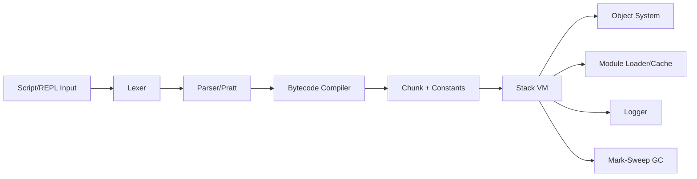
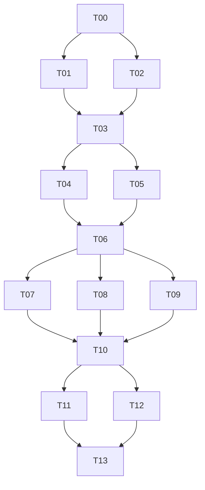

# Requirements.md

## 1. 背景与目标

Maple 是一个参考 Crafting Interpreters 中 clox 路线实现的脚本语言运行时项目，采用 C++23+ 构建。
目标是在保持 clox 核心语义与执行模型的基础上，实现工程化、可测试、跨平台（Windows/MSVC 与 Linux/GCC）的现代版本，并新增模块导入能力（`import` 与 `from ... import ... as ...`）。

核心目标：
1. 完整的字节码编译与栈式 VM 执行能力。
2. 可用的垃圾回收机制（GC），支持复杂对象图与闭包生命周期管理。
3. 模块系统与导入语义扩展。
4. 内部彩色分级日志系统。
5. 清晰的多文件工程结构、CMake 构建体系与独立测试目录。

## 2. 范围定义

### 2.1 In Scope

1. 词法分析、语法解析、字节码生成、虚拟机解释执行完整链路。
2. clox 等价核心语言能力：表达式、语句、控制流、函数、闭包、类与继承、方法调用、原生函数桥接。
3. GC（至少 mark-sweep，包含根集合追踪）。
4. Maple 模块系统（`import` 与 `from ... import ... as ...`）。
5. REPL 与脚本文件执行模式。
6. 跨平台构建与测试基线（MSVC/GCC）。
7. 内置 logger（分级、彩色、可配置）。

### 2.2 Out of Scope

1. JIT/AOT 编译。
2. 多线程 VM 与并发 GC。
3. 包管理器与远程模块仓库。
4. GUI 调试器。
5. 与 Python/JS 完全语义兼容。

## 3. 功能需求（按优先级）

### 3.1 P0（首版必须）

1. 语言核心：变量、作用域、条件、循环、函数、闭包、类、继承、方法绑定。
2. 字节码与 VM：指令执行、调用帧、栈管理、运行时错误报告。
3. GC：对象分配追踪、可达性标记、清扫回收、字符串驻留支持。
4. 文件执行与 REPL。
5. `import module`：模块加载、缓存、一次初始化。
6. `from module import name as alias`：符号导入与别名绑定。
7. Logger：`TRACE/DEBUG/INFO/WARN/ERROR/FATAL` 级别与颜色映射。
8. CMake 跨平台构建 + 基础测试集。

### 3.2 P1（首版后增强）

1. 模块循环依赖的显式诊断与部分初始化策略优化。
2. 更精确的报错定位（文件、行、列、调用栈）。
3. 可配置 GC 阈值与调试统计输出。
4. 快照测试与回归测试工具链统一。

### 3.3 P2（演进方向）

1. 字节码优化（常量折叠、窥孔优化）。
2. 增量 GC 预研接口。
3. 可插拔模块加载器。

## 4. 非功能需求

1. 可移植性：Windows 10+/11 + MSVC（19.3x+），Linux + GCC（13+）可构建运行。
2. 可维护性：模块化多文件结构，`.hh/.cc` 分离，`namespace ms` 统一。
3. 可观测性：日志分级、过滤、关键路径埋点（编译/执行/GC/模块加载）。
4. 性能：在教学可读性前提下保证线性可扩展。
5. 稳定性：非法脚本不导致宿主进程崩溃（除不可恢复错误）。

## 5. import 语义需求（精确定义）

1. `import foo.bar`
- 解析 `foo.bar` 为规范模块标识（可映射到路径）。
- 首次导入执行模块顶层代码并缓存模块对象。
- 重复导入返回缓存，不重复执行。

2. `from foo.bar import baz as qux`
- 导入时校验 `baz` 存在。
- 将 `baz` 绑定到当前作用域 `qux`。
- 未指定 `as` 时默认原名绑定。

3. 错误情形
- 模块不存在、符号不存在、循环依赖导致未初始化访问，均需明确错误类型与定位信息。

## 6. 测试需求

1. `tests/` 独立目录管理。
2. 覆盖：词法/语法/编译单测、VM 指令行为、GC 生命周期、模块导入语义与错误路径、REPL/CLI 集成、跨平台冒烟测试。
3. 测试脚本覆盖正常流、边界流、错误流、回归场景。

## 7. 里程碑与验收（DoD）

| 里程碑 | 交付物 | 验收标准 |
|---|---|---|
| M1 | 基础前端 + 字节码 + VM | 基础语句与函数测试通过 |
| M2 | 闭包/类/继承 + GC | 对象生命周期与闭包测试通过 |
| M3 | 模块系统 | 模块缓存、别名导入、错误路径测试通过 |
| M4 | Logger + 跨平台构建 + 测试完善 | Windows/Linux CI 通过 |

---

# Design.md

## 1. 总体架构



## 2. 关键设计决策

1. 编译期与运行时职责分离，降低耦合。
2. 采用 clox 风格单遍编译（Pratt + 直接生成字节码），首版不强依赖完整 AST。
3. GC 首版采用 mark-sweep。
4. 模块首版采用“源码级即时加载编译执行”，并引入模块缓存。
5. logger 采用轻量接口 + 平台适配层（ANSI/Windows 控制台）。

## 3. 推荐目录结构

```text
Maple/
  CMakeLists.txt
  cmake/
  src/
    main.cc
    cli/
      app.hh
      app.cc
    frontend/
      token.hh
      lexer.hh
      lexer.cc
      parser.hh
      parser.cc
      compiler.hh
      compiler.cc
    bytecode/
      opcode.hh
      chunk.hh
      chunk.cc
      disasm.hh
      disasm.cc
    runtime/
      value.hh
      object.hh
      object.cc
      table.hh
      table.cc
      vm.hh
      vm.cc
      gc.hh
      gc.cc
      module.hh
      module.cc
    support/
      logger.hh
      logger.cc
      source.hh
      source.cc
  tests/
    unit/
    integration/
    scripts/
      language/
      gc/
      module/
      cli/
```

---

# Task Decomposition (Multi-Agent Ready)

## 1. 拆分原则

1. 每个 Task 必须“单一目标 + 独立交付 + 可测试 + 可验证”。
2. 每个 Task 明确输入、输出、依赖、验收标准。
3. 支持并行：标注可并行组（Parallel Group）。
4. 每个 Task 应可由独立 agent/subagent 执行，减少跨文件强耦合。
5. 先搭骨架再填功能：基础设施 Task 优先。

## 2. 任务总览与依赖图



## 3. Task 清单（可执行、可测试、可验证）

### T00 - 工程初始化与约束落地（P0）

- Goal: 建立 CMake 工程骨架与目录结构，锁定 C++23、命名空间约束、文件后缀规范。
- Status: completed (2026-03-08)
- Inputs: PLAN.md、AGENTS.md。
- Outputs:
  - `CMakeLists.txt`
  - `src/`, `tests/`, `cmake/` 基础目录
  - 最小可编译空 target（`maple_core`, `maple_cli`）
- Depends On: 无
- Parallel Group: G0
- Test:
  - CMake configure 成功
  - 空程序可构建
- Verify:
  - `cmake -S . -B build`
  - `cmake --build build`
- DoD:
  - Windows/Linux 均可通过基础构建。

### T01 - 日志系统（P0）

- Goal: 实现 logger 等级、格式、颜色映射与平台适配接口。
- Status: completed (2026-03-08, subagent-A)
- Inputs: T00 骨架。
- Outputs:
  - `src/support/logger.hh/.cc`
  - 日志等级配置入口
- Depends On: T00
- Parallel Group: G1
- Test:
  - 单元测试：等级过滤、格式化、颜色开关
- Verify:
  - 执行 logger 测试，人工核对颜色输出
- DoD:
  - TRACE/DEBUG/INFO/WARN/ERROR/FATAL 均可输出且可过滤。

### T02 - 源文件与错误位置信息基础设施（P0）

- Goal: 实现源码装载、行列映射、统一错误位置信息结构。
- Status: completed (2026-03-08, subagent-A)
- Outputs:
  - `src/support/source.hh/.cc`
  - 统一错误位置数据结构
- Depends On: T00
- Parallel Group: G1
- Test:
  - 行列映射单测
  - 文件读取错误路径单测
- Verify:
  - 测试覆盖正常/异常读取

### T03 - 字节码容器与反汇编器（P0）

- Goal: 落地 opcode 定义、chunk 常量池、行号表、反汇编。
- Status: completed (2026-03-08, subagent-A)
- Outputs:
  - `src/bytecode/opcode.hh`
  - `src/bytecode/chunk.hh/.cc`
  - `src/bytecode/disasm.hh/.cc`
- Depends On: T01, T02
- Parallel Group: G2
- Test:
  - 指令写入/读取一致性
  - 常量池索引边界测试
  - 反汇编快照测试
- Verify:
  - 对固定 chunk 生成稳定反汇编文本

### T04 - 词法分析器（P0）

- Goal: 完成 token 定义与 lexer（包含关键字、字符串、数字、注释）。
- Status: completed (2026-03-08, subagent-B)
- Outputs:
  - `src/frontend/token.hh`
  - `src/frontend/lexer.hh/.cc`
- Depends On: T03
- Parallel Group: G3
- Test:
  - token golden tests（正常与非法输入）
- Verify:
  - `tests/unit/frontend/lexer_*`

### T05 - 值类型与对象系统基座（P0）

- Goal: 构建 `Value`、`Obj` 基类及字符串对象/哈希表基础。
- Status: completed (2026-03-08, subagent-C)
- Outputs:
  - `src/runtime/value.hh`
  - `src/runtime/object.hh/.cc`
  - `src/runtime/table.hh/.cc`
- Depends On: T03
- Parallel Group: G3
- Test:
  - Value 判型与比较
  - 字符串驻留与哈希表读写
- Verify:
  - 单测覆盖对象创建、查找、驻留复用

### T06 - VM 栈机最小闭环（P0）

- Goal: 最小指令集执行（常量、算术、比较、跳转、打印、返回）与调用栈基础。
- Status: completed (2026-03-08, subagent-C)
- Outputs:
  - `src/runtime/vm.hh/.cc`
- Depends On: T04, T05
- Parallel Group: G4
- Test:
  - 指令级单测
  - 小脚本集成测试（表达式/分支/循环）
- Verify:
  - 测试脚本返回码与输出匹配

### T07 - 解析器（Pratt）与表达式编译（P0）

- Goal: parser + compiler 完成表达式与基础语句到字节码生成。
- Status: completed (2026-03-08, subagent-B)
- Outputs:
  - `src/frontend/parser.hh/.cc`
  - `src/frontend/compiler.hh/.cc`
- Depends On: T06
- Parallel Group: G5
- Test:
  - 编译产物字节码快照
  - 语法错误诊断测试
- Verify:
  - 固定输入脚本输出固定反汇编

### T08 - 函数/闭包/upvalue（P0）

- Goal: 实现函数对象、调用帧、闭包捕获与 upvalue 生命周期。
- Status: completed (2026-03-08, clox-full-semantics-upgrade, closure-batch)
- Current State:
  - 已完成最小可运行桥接实现（baseline bridge），但尚未达到 clox 完整闭包语义。
  - 2026-03-08 补充了词法与运行时对象承载基础：`fun/return/class/this/super` 关键字和相关符号 token 已接入 lexer；`Value` 已支持通用运行时对象持有（`RuntimeObject`），为 closure/class 对象模型接入提供存储通道。
- Design & Implementation Tasks (No Code Yet):
  - `T08-D1` 对象模型补全：`ObjFunction / ObjClosure / ObjUpvalue`、函数原型、常量池与闭包对象关系。
  - `T08-D2` 编译器语义补全：局部变量解析、上值解析（递归向外层捕获）、函数声明/匿名函数、作用域深度与逃逸变量管理。
  - `T08-D3` VM 执行链补全：`OP_CALL`、`OP_CLOSURE`、`OP_GET_UPVALUE`、`OP_SET_UPVALUE`、`OP_CLOSE_UPVALUE`、`OP_RETURN` 与调用帧窗口。
  - `T08-D4` 运行时一致性：递归、闭包写回、循环捕获、返回后上值存活、错误栈追踪与消息格式。
  - `T08-D5` 测试矩阵：闭包 golden 脚本、递归/高阶函数、边界错误（参数个数、未定义变量、非法调用）与回归集合。
- Outputs:
  - `src/runtime/object.hh/.cc`（函数/闭包/upvalue 对象）
  - `src/runtime/vm.hh/.cc`（调用帧+upvalue 生命周期）
  - `src/frontend/compiler.hh/.cc`（闭包编译路径）
  - `tests/scripts/language/closure_*`
  - `tests/integration/closure_*`
- Depends On: T06
- Parallel Group: G5
- Test:
  - 闭包捕获（读/写）语义测试
  - 递归与高阶函数测试
  - 上值关闭时机测试（离开作用域后仍可访问）
- Verify:
  - 与 clox Chapter 24~26 同类样例行为一致（输出和错误路径一致）

### T09 - 类/继承/方法绑定（P0）

- Goal: 实现 class、instance、method、super 调用链。
- Status: completed (2026-03-08, clox-full-semantics-upgrade, class-inheritance-batch)
- Current State:
  - 已完成最小可运行桥接实现（baseline bridge），但尚未达到 clox 完整 class/inheritance 语义。
  - 2026-03-08 已完成类语义前置基础：新增 class 语法关键 token 与对象值通道，后续可在不破坏 `Value` ABI 的前提下落地 `ObjClass/ObjInstance/ObjBoundMethod` 与调用分派链。
- Design & Implementation Tasks (No Code Yet):
  - `T09-D1` 对象模型补全：`ObjClass / ObjInstance / ObjBoundMethod` 与字段表、方法表布局。
  - `T09-D2` 编译器语义补全：`class` 声明、方法编译、`this` 绑定规则、`super` 解析与继承约束（禁止自继承）。
  - `T09-D3` VM 指令链补全：`OP_CLASS`、`OP_INHERIT`、`OP_METHOD`、`OP_GET_PROPERTY`、`OP_SET_PROPERTY`、`OP_GET_SUPER`、`OP_INVOKE`、`OP_SUPER_INVOKE`。
  - `T09-D4` 运行时一致性：构造器 `init`、方法分派、绑定方法对象生命周期、字段遮蔽与覆盖解析顺序。
  - `T09-D5` 测试矩阵：类定义/实例字段/方法调用/继承覆盖/`super` 链/错误路径回归。
- Outputs:
  - `src/runtime/object.hh/.cc`（类/实例/绑定方法对象）
  - `src/runtime/vm.hh/.cc`（属性访问与调用分派）
  - `src/frontend/compiler.hh/.cc`（class/this/super 编译路径）
  - `tests/scripts/language/class_*`
  - `tests/integration/class_*`
- Depends On: T06
- Parallel Group: G5
- Test:
  - 类定义、字段读写、方法调用、继承覆盖测试
  - `this`/`super` 语义与错误路径测试
- Verify:
  - 与 clox Chapter 27~29 同类样例行为一致（输出和错误路径一致）

### T10 - GC（mark-sweep）接入（P0）

- Goal: 完整 GC 根扫描、标记、清扫、触发阈值与统计日志。
- Status: completed (2026-03-08, subagent-C)
- Outputs:
  - `src/runtime/gc.hh/.cc`
  - VM/对象系统 GC 钩子接入
- Depends On: T07, T08, T09
- Parallel Group: G6
- Test:
  - 压力分配回收测试
  - 闭包/类/字符串在回收中的存活测试
  - 回归：无悬垂引用
- Verify:
  - GC 日志统计与对象数量变化符合预期

### T11 - 模块系统：import（P0）

- Goal: 支持 `import module`，含路径解析、加载、编译执行、缓存。
- Status: completed (2026-03-08, subagent-D)
- Outputs:
  - `src/runtime/module.hh/.cc`
  - 编译器与 VM 的导入指令/调用路径
- Depends On: T10
- Parallel Group: G7
- Test:
  - 首次导入执行、重复导入缓存复用
  - 模块不存在错误
- Verify:
  - 模块顶层副作用只执行一次

### T12 - 模块系统：from import as（P0）

- Goal: 支持 `from a.b import x as y` 语义与错误处理。
- Status: completed (2026-03-08, subagent-D)
- Outputs:
  - parser/compiler/module/vm 对应扩展
- Depends On: T10
- Parallel Group: G7
- Test:
  - 导入符号绑定与别名绑定
  - 符号不存在错误
  - 循环依赖未初始化访问错误
- Verify:
  - 各语义脚本断言通过

### T13 - CLI/REPL + 测试总装 + 跨平台 CI（P0）

- Goal: 完整交付入口程序、测试目录、ctest 集成、跨平台验证脚本。
- Status: completed (2026-03-08, subagent-D)
- Outputs:
  - `src/main.cc`, `src/cli/app.hh/.cc`
  - `tests/unit`, `tests/integration`, `tests/scripts`
  - `CTest` 配置与最小 CI 脚本
- Depends On: T11, T12
- Parallel Group: G8
- Test:
  - CLI 参数测试
  - REPL 基本交互测试
  - 端到端脚本测试
- Verify:
  - `ctest --output-on-failure` 全通过
  - Windows/Linux 双平台构建与测试通过

## 4. 子任务模板（供多 Agent 复用）

每个子 Agent 必须按以下模板提交结果：

1. Task ID
2. 变更文件清单
3. 行为变更说明
4. 新增/更新测试
5. 本地验证命令与结果
6. 风险与后续建议

## 5. 并行执行建议（Agent 编排）

1. Wave 1: `T00`
2. Wave 2: `T01 + T02`（并行）
3. Wave 3: `T03`
4. Wave 4: `T04 + T05`（并行）
5. Wave 5: `T06`
6. Wave 6: `T07 + T08 + T09`（baseline）
7. Wave 6R: `T08-D1~D5 + T09-D1~D5`（clox 完整语义升级）
8. Wave 7: `T10`
9. Wave 8: `T11 + T12`（并行）
10. Wave 9: `T13`

## 6. 验收矩阵（Task -> 可验证产物）

| Task | 可执行 | 可测试 | 可验证 |
|---|---|---|---|
| T00 | CMake 可构建 | 构建冒烟 | configure/build 命令成功 |
| T01 | logger demo | 单元测试 | 等级过滤与颜色输出 |
| T02 | source loader demo | 单元测试 | 错误定位准确 |
| T03 | chunk/disasm demo | 单元+快照 | 反汇编稳定 |
| T04 | lexer CLI | 单元+golden | token 序列一致 |
| T05 | object/table demo | 单元测试 | 驻留与哈希行为稳定 |
| T06 | VM demo | 指令集成 | 脚本输出匹配 |
| T07 | compile demo | 编译快照 | 字节码一致 |
| T08 | closure demo | 集成测试 | 捕获语义正确 |
| T09 | class demo | 集成测试 | 继承与方法解析正确 |
| T10 | GC stress demo | 压测+回归 | 无泄漏/悬垂（以测试为准） |
| T11 | import demo | 集成测试 | 缓存复用、一次初始化 |
| T12 | from-import-as demo | 集成测试 | 别名绑定与错误路径正确 |
| T13 | CLI/REPL executable | 全量测试 | ctest + 双平台通过 |

## 7. 分支与提交策略（多 Agent）

1. 每个 Task 使用独立分支：`task/Txx-short-name`。
2. 每个 Task 至少一组“功能 commit + 测试 commit”（可合并为 1 个原子 commit）。
3. 提交信息必须英文，且包含 gitmoji（遵循 AGENTS.md）。
4. 合并顺序严格按依赖图，自底向上。

## 8. 风险控制点（执行期）

1. T08/T09 与 T10 的接口冻结点必须提前定义（防止 GC 接入返工）。
2. T11/T12 必须在 parser 语法与 VM 指令层对齐后再并行。
3. 任一 Task 若修改公共对象布局，必须触发受影响 Task 回归测试。

## 9. 完整交付判定

满足以下条件即视为 PLAN 对应功能“可实施且可验证”：

1. T00-T13 全部完成并通过定义测试，且 T08/T09 达到 clox 完整语义（闭包 + 类继承）。
2. tests 目录具备单元、集成、脚本测试分层。
3. `import` 与 `from ... import ... as ...` 覆盖正常与错误路径。
4. VM + GC + logger + 跨平台构建均有可复现实证。

## 2026-03-08 Incremental Update
- T08 status: completed (closure batch, D1~D5).
- T09 status: completed (class/inheritance batch).
- Verification: cmake --build build --config Debug; ctest --test-dir build --output-on-failure -C Debug.

- 2026-03-08 update: T09 class/inheritance batch completed with class_* integration scripts and tests.

---

## 2026-03-08 Language Professionalization Iteration Plan (No Code Yet)

### A. Current Implementation Assessment (Expert Review)

- Runtime architecture is currently **dual-path**:
  - `Vm::Execute` runs a minimal bytecode instruction set.
  - `Vm::ExecuteSource` routes to `ScriptInterpreter` (tree-walk style with its own AST/parser/evaluator).
  - This causes semantic drift risk and makes long-term optimization and correctness harder.
- Frontend grammar is **not yet a full formal language grammar**:
  - Token set and parser are still subset-level.
  - Missing full operator lattice (`==`, `!=`, `>`, `>=`, logical `and/or`, etc.) and structured control flow (`if/else`, `while`, `for`, `break`, `continue`).
- Semantic analysis is runtime-only for many rules:
  - No resolver pass for lexical binding depth.
  - `this/super` misuse is mostly diagnosed at runtime, not compile-time.
- Object/value model is still transitional:
  - `Value` is variant-based and mixes module/object primitives pragmatically.
  - No finalized language-level object protocol and identity/equality model doc.
- GC is currently threshold-counter behavior, not production tracing GC.
- Module system works functionally, but language-level contract is under-specified:
  - Export surface, visibility, and initialization contract need a formal definition.
- Diagnostics and conformance are still engineering-oriented, not language-standard oriented:
  - Error metadata (span, phase, code) and compatibility suite are insufficient for a “formal language” baseline.

### B. Iteration Goal (Professional/Formal Language Baseline)

Define Maple as a spec-driven language runtime with:

1. Single canonical execution semantics (bytecode VM as source of truth).
2. Versioned language specification (lexical/syntax/static semantics/runtime semantics).
3. Deterministic diagnostics model (phase + span + stable message contract).
4. Formal module boundary contract and testable conformance suite.
5. Traceable release gates from feature design -> implementation -> verification.

### C. New Task Set (Planning Only)

#### T14 - Language Specification v0.1 (P0)
- Goal: produce first formal spec package and freeze baseline semantics.
- Status: draft completed (2026-03-08, docs-only; no runtime/compiler implementation changes)
- Deliverables:
  - `docs/spec/lexical.md` (tokens, literals, comments, escapes, reserved words)
  - `docs/spec/grammar.ebnf` (complete grammar baseline)
  - `docs/spec/semantics.md` (scope, closures, class/super, modules, truthiness, equality)
  - `docs/spec/errors.md` (error taxonomy and diagnostic shape)
- Acceptance:
  - Every implemented syntax/semantic behavior maps to an explicit spec section.
  - Ambiguities are listed as explicit TBD items (not implicit behavior).
- Draft Completion Notes (2026-03-08):
  - Added draft files:
    - `docs/spec/lexical.md`
    - `docs/spec/grammar.ebnf`
    - `docs/spec/semantics.md`
    - `docs/spec/errors.md`
  - Scope of completion:
    - Specification draft is complete for v0.1 planning.
    - No compiler/VM/interpreter behavior was changed in this step.

##### T14-GAP - Spec vs Implementation Delta (to be closed by T15/T16/T20)

- `GAP-01` Execution-path divergence:
  - Spec assumes unified normative semantics; current runtime uses dual-path (`Vm::Execute` vs `ScriptInterpreter`).
  - Status: closed (2026-03-08, W10)
  - Evidence:
    - `Vm::ExecuteSource` now routes compile+bytecode+VM first.
    - legacy interpreter kept only under explicit mode gate (`kLegacyOnly` / compatibility fallback).
- `GAP-02` Grammar overhang:
  - Spec includes logical/comparison/control-flow grammar not fully present in current parser/compiler/interpreter path.
- `GAP-03` Static semantic phase missing:
  - Spec defines resolve-phase errors (`return/this/super` context rules); implementation is mostly runtime-checked.
  - Status: closed (2026-03-08, W11)
  - Evidence:
    - `ScriptInterpreter::Execute` now runs resolver before execution and blocks run on resolve diagnostics.
    - `MS3001/MS3002/MS3003/MS3004` violations are emitted as resolve-phase compile-like errors.
- `GAP-04` Diagnostic schema not yet enforced:
  - Spec defines `phase/code/span/notes`; implementation currently uses free-form message strings.
- `GAP-05` Conformance mapping absent:
  - Spec requires rule-to-test traceability; current tests are feature-focused, not full conformance matrix driven.

#### T15 - Execution Architecture Unification Plan (P0)
- Goal: converge to one normative semantics path, with clear transition strategy.
- Status: draft completed (2026-03-08, docs-only; no runtime/compiler implementation changes)
- Deliverables:
  - ADR: `docs/adr/ADR-001-execution-model.md`
  - Explicit decision on `ScriptInterpreter` role:
    - Option A: temporary bootstrap only, phased out.
    - Option B: kept as reference interpreter with strict parity tests.
  - Semantic parity matrix (`source case -> VM behavior == interpreter behavior`).
- Acceptance:
  - No newly added language feature may bypass the chosen normative path.
- Draft Completion Notes (2026-03-08):
  - Added ADR draft:
    - `docs/adr/ADR-001-execution-model.md`
  - Decision captured:
    - Bytecode VM is the sole normative execution engine.
    - `ScriptInterpreter` is transitional and non-normative during migration.
  - Scope of completion:
    - Architecture decision and migration strategy documented.
    - No implementation switch was performed in this step.

##### T15-GAP - ADR vs Current Runtime Delta (to be closed by T20 and implementation waves)

- `GAP-01` Default source execution still routes through `ScriptInterpreter`.
  - Status: closed (2026-03-08, W10-D1/D2)
  - Evidence:
    - `Vm::ExecuteSource` switched to VM-first default route with compile/runtime category mapping.
- `GAP-02` VM bytecode path does not yet cover full language semantics parity.
- `GAP-03` Parity matrix and CI gate are not yet established.
- `GAP-04` Interpreter retirement/reference-mode decision is documented but not enacted.
  - Status: deferred (2026-03-08, W10-D4)
  - Evidence:
    - interpreter retained as explicit transitional/reference mode (`SourceExecutionMode`) pending later retirement wave.

#### T16 - Static Semantics & Resolver Design (P0)
- Goal: move language rule enforcement to compile/resolution phase where appropriate.
- Status: partially implemented (2026-03-08, W11 baseline over legacy execution path)
- Deliverables:
  - Resolver design doc (`docs/design/resolver.md`)
  - Rule table:
    - lexical depth resolution,
    - local/global shadowing policy,
    - `return` restrictions,
    - `this/super` valid contexts,
    - class inheritance legality checks.
- Acceptance:
  - Each rule defines: detection phase, error code, and canonical message template.
- Draft Completion Notes (2026-03-08):
  - Added resolver design draft:
    - `docs/design/resolver.md`
  - Scope of completion:
    - Resolver data model, algorithm, and rule table documented.
    - No resolver pass is implemented in parser/compiler in this step.

##### T16-GAP - Resolver Spec vs Compiler Pipeline Delta

- `GAP-01` No dedicated resolve phase exists in current frontend pipeline.
  - Status: closed (2026-03-08, W11-D1)
  - Evidence:
    - explicit resolver phase inserted in `ScriptInterpreter::Execute` after parse and before runtime execution.
- `GAP-02` Lexical depth metadata is not emitted for compiler backend.
  - Status: closed (2026-03-08, W11-D2)
  - Evidence:
    - resolver emits local-depth metadata and executor consumes depth-aware `GetAt/AssignAt`.
- `GAP-03` `MS3xxx` resolve diagnostics are not yet produced by implementation.
  - Status: closed (2026-03-08, W11-D3)
  - Evidence:
    - resolver emits `MS3001/MS3002/MS3003/MS3004` and `Vm` classifies them as compile errors.
- `GAP-04` Closure capture planning is runtime/interpreter-driven, not resolver-driven.
  - Status: deferred (2026-03-08, W11-D2)
  - Evidence:
    - lexical depth is resolved, but closure planning is not yet lowered into VM compiler/upvalue instruction path.

#### T17 - Type/Value/Object Semantics Formalization (P1)
- Goal: define runtime value algebra and object protocol precisely.
- Status: draft completed (2026-03-08, docs-only; no value/object implementation changes)
- Deliverables:
  - `docs/spec/value-model.md`
  - Decision records for:
    - numeric model and coercion policy,
    - equality and identity semantics,
    - callable contract,
    - method binding contract.
- Acceptance:
  - All operators and builtins have deterministic operand/result/error rules.
- Draft Completion Notes (2026-03-08):
  - Added value/object model draft:
    - `docs/spec/value-model.md`
  - Scope of completion:
    - Numeric model, equality/identity, callable contract, and method binding semantics documented.
    - No operator/runtime behavior changes in this step.

##### T17-GAP - Value Spec vs Runtime Behavior Delta

- `GAP-01` Equality operator semantics are specified but not fully implemented in language runtime path.
  - Status: deferred (2026-03-09, W12-D1/D2)
- `GAP-02` Some error-code mappings (`MS400x`) are documented but not structurally emitted yet.
  - Status: closed (2026-03-09, W12-D1/D2)
- `GAP-03` Numeric edge-case policy is documented as draft and not yet conformance-locked.
  - Status: deferred (2026-03-09, W12-D4)

#### T18 - Module & Namespace Specification Upgrade (P1)
- Goal: evolve module behavior from “works” to “specified”.
- Status: draft completed (2026-03-08, docs-only; no module loader implementation changes)
- Deliverables:
  - `docs/spec/modules.md`:
    - import resolution algorithm,
    - cache and initialization state machine,
    - circular dependency semantics,
    - export visibility policy.
  - Compatibility table for `import` and `from ... import ... as ...`.
- Acceptance:
  - Module errors are phase-specific and reproducible with script fixtures.
- Draft Completion Notes (2026-03-08):
  - Added module/namespace spec draft:
    - `docs/spec/modules.md`
  - Scope of completion:
    - Module state machine, cache rules, import compatibility table documented.
    - No loader/exports/runtime error payload changes in this step.

##### T18-GAP - Module Spec vs Loader Implementation Delta

- `GAP-01` Error payloads are currently free-form strings, not structured module diagnostics.
  - Status: closed (2026-03-09, W12-D3)
- `GAP-02` Export visibility policy remains baseline-only (no explicit export controls).
  - Status: deferred (2026-03-09, W12-D3)
- `GAP-03` Conformance-grade module matrix cases are documented but not executable as standalone harness cases.
  - Status: closed (2026-03-09, W12-D4)

#### T19 - Diagnostics Standardization (P1)
- Goal: make diagnostics stable enough for tooling and formal tests.
- Status: draft completed (2026-03-08, docs-only; no diagnostics pipeline implementation changes)
- Deliverables:
  - Diagnostic schema:
    - `docs/spec/diagnostics.md`
    - `phase` (`lex|parse|resolve|runtime|module`),
    - `code` (`MSxxxx`),
    - `span` (`file,line,column,length`),
    - primary message + optional notes.
  - `tests/diagnostics/` golden files with normalization rules.
- Acceptance:
  - Identical inputs produce stable structured diagnostics across platforms.
- Draft Completion Notes (2026-03-08):
  - Added diagnostics schema draft:
    - `docs/spec/diagnostics.md`
  - Added diagnostics golden guidance:
    - `tests/diagnostics/README.md`
    - `tests/diagnostics/NORMALIZATION.md`
    - `tests/diagnostics/samples/runtime_arity_mismatch.golden.json`
    - `tests/diagnostics/samples/module_not_found.golden.json`
  - Scope of completion:
    - Structured schema and normalization contract documented.
    - No runtime diagnostic emitter or golden harness implementation in this step.

##### T19-GAP - Diagnostics Spec vs Emission/Test Pipeline Delta

- `GAP-01` Runtime currently does not emit canonical structured diagnostic records.
- `GAP-02` Existing tests do not parse/compare diagnostics JSON goldens.
- `GAP-03` Column/length span fields are not consistently available.
- `GAP-04` CI has no diagnostics-golden stage yet.

#### T20 - Conformance & Regression Test System (P0)
- Goal: transition from feature demos to language conformance validation.
- Status: draft completed (2026-03-08, docs-only; no test runner/runtime implementation changes)
- Deliverables:
  - `tests/conformance/` organized by spec chapter.
  - Harness metadata (`expect: ok|compile_error|runtime_error`, output/error matching mode).
  - Coverage matrix mapping T14 spec clauses -> concrete tests.
- Acceptance:
  - Each normative rule in T14 has at least one positive and one negative case.
- Draft Completion Notes (2026-03-08):
  - Added conformance docs:
    - `tests/conformance/README.md`
    - `tests/conformance/CASE_FORMAT.md`
    - `tests/conformance/MATRIX.md`
  - Scope of completion:
    - Conformance structure, metadata contract, and initial spec mapping documented.
    - No conformance test harness or CI wiring implementation in this step.

##### T20-GAP - Conformance Plan vs Executable Pipeline Delta

- `GAP-01` Conformance cases are not yet materialized as standalone `tests/conformance/*.ms` files.
- `GAP-02` No parser/harness to read `@` metadata contract exists yet.
- `GAP-03` CI does not yet include conformance-stage pass/fail gate.
- `GAP-04` Diagnostics are not yet fully structured (`phase/code/span`) for strict matching.

### D. Milestone & Gate Updates

- New milestone `M5 (Formalization Baseline)`:
  - Exit criteria:
    - T14 + T15 + T20 completed.
    - T16 design approved.
    - Existing language features covered by conformance matrix.
- New milestone `M6 (Spec-Driven Runtime)`:
  - Exit criteria:
    - T16~T19 completed.
    - Diagnostic schema enforced in CI.
    - Module/value/object semantics marked “normative” in docs.

### E. Risks and Controls

- Risk: dual execution paths continue to diverge.
  - Control: introduce parity suite immediately after T15.
- Risk: feature additions outpace specification.
  - Control: “spec-first PR gate” for syntax/semantic changes.
- Risk: diagnostics churn breaks tests.
  - Control: stable error code policy + golden update protocol.

### F. Priority Execution Order

1. T14 (spec baseline)
2. T15 (execution model decision + parity strategy)
3. T20 (conformance harness baseline)
4. T16 (resolver design freeze)
5. T17 + T18 (value/object/module formalization)
6. T19 (diagnostics standardization and CI locking)

## 2026-03-08 Incremental Update (Spec Track)
- T14 status updated to `draft completed (docs-only)`.
- Added specification drafts:
  - `docs/spec/lexical.md`
  - `docs/spec/grammar.ebnf`
  - `docs/spec/semantics.md`
  - `docs/spec/errors.md`
- Added `T14-GAP` list to track spec-to-implementation deltas for T15/T16/T20.
- T15 status updated to `draft completed (docs-only)`.
- Added ADR draft:
  - `docs/adr/ADR-001-execution-model.md`
- Added `T15-GAP` list to track architecture-decision deltas to implementation/CI.
- T20 status updated to `draft completed (docs-only)`.
- Added conformance planning docs:
  - `tests/conformance/README.md`
  - `tests/conformance/CASE_FORMAT.md`
  - `tests/conformance/MATRIX.md`
- Added `T20-GAP` list to track conformance-plan deltas to executable pipeline.
- T16 status updated to `draft completed (docs-only)`.
- Added resolver design draft:
  - `docs/design/resolver.md`
- Added `T16-GAP` list to track resolver-design deltas to compiler pipeline.
- T17 status updated to `draft completed (docs-only)`.
- Added value/object semantics draft:
  - `docs/spec/value-model.md`
- Added `T17-GAP` list to track value-spec deltas to runtime behavior.
- T18 status updated to `draft completed (docs-only)`.
- Added modules/namespace spec draft:
  - `docs/spec/modules.md`
- Added `T18-GAP` list to track module-spec deltas to loader behavior.
- T19 status updated to `draft completed (docs-only)`.
- Added diagnostics schema and golden-guideline drafts:
  - `docs/spec/diagnostics.md`
  - `tests/diagnostics/README.md`
  - `tests/diagnostics/NORMALIZATION.md`
  - `tests/diagnostics/samples/runtime_arity_mismatch.golden.json`
  - `tests/diagnostics/samples/module_not_found.golden.json`
- Added `T19-GAP` list to track diagnostics-spec deltas to emission/test/CI pipeline.

## 2026-03-08 Implementation Mapping Package (W10~W13, Docs-Only)

This section maps `T14~T20` GAP items to executable implementation waves.
No code changes are included in this section; it is a build-ready execution blueprint.

### W10 - Normative Execution Path Switch (T15/T14/T20 bridge)

- Status: completed (2026-03-08, subagents-mode; Batch A/B/C)

- Goal:
  - make compiler+bytecode+VM the default normative path for `ExecuteSource`
  - retain `ScriptInterpreter` only as temporary opt-in reference/debug path
- Targets:
  - `src/runtime/vm.cc`
  - `src/runtime/vm.hh`
  - `src/runtime/script_interpreter.cc`
  - `src/runtime/script_interpreter.hh`
  - `tests/unit/test_vm_compiler.cc`
  - `tests/integration/test_language_closure.cc`
  - `tests/integration/test_language_class.cc`
- GAP Closure:
  - T15-GAP `GAP-01`, `GAP-04`
  - T14-GAP `GAP-01`
- DoD:
  - default source execution path is VM pipeline
  - interpreter path is explicitly marked non-normative and guarded
  - existing integration behavior remains unchanged (or documented deltas)
- Verify:
  - `cmake --build build --config Debug`
  - `ctest --test-dir build --output-on-failure -C Debug`

#### W10 Detailed Task List (D1~D5)

- `W10-D1` Execution entry switch design and guard flags
  - Scope:
    - define normative/default `ExecuteSource` route as compile+VM
    - define optional fallback/reference flag for `ScriptInterpreter`
  - Primary files:
    - `src/runtime/vm.hh`
    - `src/runtime/vm.cc`
  - Tests:
    - add/adjust unit tests to assert default path selection behavior
  - Acceptance:
    - default invocation path no longer depends on interpreter-only semantics
  - Commit suggestion:
    - `:construction: refactor(maple): make VM pipeline default source execution path`
  - Rollback point:
    - keep one commit boundary before behavior switch.

- `W10-D2` Bridge compatibility wrapper and error category parity
  - Scope:
    - preserve compile/runtime error category mapping consistency during switch
    - keep interpreter mode explicitly non-normative
  - Primary files:
    - `src/runtime/vm.cc`
    - `src/runtime/script_interpreter.hh`
    - `src/runtime/script_interpreter.cc`
  - Tests:
    - `tests/unit/test_vm_compiler.cc` error category assertions
  - Acceptance:
    - compile errors and runtime errors remain stable at API boundary
  - Commit suggestion:
    - `:construction: chore(maple): normalize ExecuteSource error mapping during path migration`
  - Rollback point:
    - isolate mapping changes from path-switch commit.

- `W10-D3` Regression lock for closure/class behavioral baseline
  - Scope:
    - ensure existing closure/class integration outputs remain stable
  - Primary files:
    - `tests/integration/test_language_closure.cc`
    - `tests/integration/test_language_class.cc`
  - Tests:
    - extend assertions to include explicit route-independent behavior checks
  - Acceptance:
    - closure/class integration tests pass unchanged outputs
  - Commit suggestion:
    - `:white_check_mark: test(maple): lock closure/class baseline across execution path switch`
  - Rollback point:
    - tests-only commit can be reverted independently.

- `W10-D4` Documentation and runtime mode policy alignment
  - Scope:
    - annotate interpreter as transitional/reference
    - align internal comments/docs with ADR-001 decision
  - Primary files:
    - `src/runtime/script_interpreter.hh`
    - `docs/adr/ADR-001-execution-model.md`
    - `PLAN.md`
  - Tests:
    - none (docs/policy)
  - Acceptance:
    - no ambiguity on normative engine ownership
  - Commit suggestion:
    - `:memo: docs(maple): mark interpreter path transitional per ADR-001`
  - Rollback point:
    - docs-only commit.

- `W10-D5` Wave closeout and evidence capture
  - Scope:
    - run build/test commands and capture pass evidence in plan increment note
  - Primary files:
    - `PLAN.md`
  - Tests:
    - `cmake --build build --config Debug`
    - `ctest --test-dir build --output-on-failure -C Debug`
  - Acceptance:
    - W10 GAP items marked `closed|deferred` with evidence
  - Commit suggestion:
    - `:memo: docs(maple): record W10 verification and GAP closure status`
  - Rollback point:
    - closeout note is isolated.

#### W10 Closeout Note (2026-03-08)

- Delivered:
  - `W10-D1`: added execution mode and route guard in `Vm` with VM-first default.
  - `W10-D2`: normalized compile/runtime category mapping for VM and legacy compatibility path.
  - `W10-D3`: locked closure/class regression behavior with route-independent assertions.
  - `W10-D4`: marked interpreter as transitional in runtime header and ADR-aligned policy.
  - `W10-D5`: build/test verification captured below.
- Verification commands:
  - `cmake --build build --config Debug`
  - `ctest --test-dir build --output-on-failure -C Debug`
- W11 test fixture expansion (2026-03-08):
  - Added detailed resolver fixtures under `tests/scripts/language/`:
    - success paths: `resolver_ok_return_in_function.ms`, `resolver_ok_this_in_nested_function.ms`,
      `resolver_ok_super_in_subclass.ms`
    - error variants: `error_resolve_top_level_return_in_block.ms`,
      `error_resolve_this_in_free_function.ms`, `error_resolve_super_without_superclass_method.ms`
  - Extended `tests/integration/test_language_resolver.cc` with success-path output checks and
    additional `MS3001/MS3002/MS3003` failure assertions.
- Verification result:
  - pass (`1/1` test, `maple_tests`)

### W11 - Resolver + Static Semantics Integration (T16-driven)

- Status: completed (2026-03-08, subagents-mode; Batch A/B/C)

- Goal:
  - introduce explicit resolve phase between parse and compile/runtime
  - enforce `MS3xxx` class static semantic rules
- Targets:
  - `src/frontend/parser.hh`
  - `src/frontend/parser.cc`
  - `src/frontend/compiler.hh`
  - `src/frontend/compiler.cc`
  - `src/frontend/` (new resolver units, e.g. `resolver.hh/.cc`)
  - `tests/conformance/semantics/*` (new)
  - `tests/conformance/diagnostics/*` (new)
- GAP Closure:
  - T16-GAP `GAP-01`, `GAP-02`, `GAP-03`, `GAP-04`
  - T14-GAP `GAP-03`
- DoD:
  - resolver emits lexical-depth metadata consumable by compiler backend
  - `return/this/super/self-inherit` violations fail in resolve phase
  - resolve diagnostics carry stable `phase=resolve` and mapped codes
- Verify:
  - `cmake --build build --config Debug`
  - `ctest --test-dir build --output-on-failure -C Debug`
  - conformance subset: resolve semantic negatives pass

#### W11 Detailed Task List (D1~D5)

- `W11-D1` Resolver module skeleton and integration seam
  - Scope:
    - introduce resolver units and call seam after parse, before compile emit
  - Primary files:
    - `src/frontend/resolver.hh` (new)
    - `src/frontend/resolver.cc` (new)
    - `src/frontend/compiler.hh`
    - `src/frontend/compiler.cc`
  - Tests:
    - compile pipeline smoke tests
  - Acceptance:
    - resolver phase executes and can return diagnostics list
  - Commit suggestion:
    - `:construction: feat(maple): add resolver phase skeleton to frontend pipeline`
  - Rollback point:
    - keep resolver skeleton in isolated commit.

- `W11-D2` Lexical depth resolution and binding metadata emission
  - Scope:
    - resolve locals/upvalues with depth metadata for compiler backend
  - Primary files:
    - `src/frontend/resolver.hh`
    - `src/frontend/resolver.cc`
    - `src/frontend/compiler.cc`
  - Tests:
    - new targeted unit tests for lexical depth and capture marking
  - Acceptance:
    - resolver metadata consumed without runtime fallback for scoped references
  - Commit suggestion:
    - `:construction: feat(maple): emit lexical depth metadata from resolver`
  - Rollback point:
    - metadata commit isolated from diagnostics commit.

- `W11-D3` Static semantic rules (`MS3xxx`) enforcement
  - Scope:
    - implement `return outside function`, `this/super misuse`, self-inherit checks
  - Primary files:
    - `src/frontend/resolver.cc`
    - `docs/spec/errors.md` (if code mapping refinement needed)
  - Tests:
    - conformance negatives:
      - `RES-RETURN-OUTSIDE-001`
      - `RES-THIS-OUTSIDE-001`
      - `RES-SUPER-OUTSIDE-001`
      - `RES-SELF-INHERIT-001`
  - Acceptance:
    - violations fail at resolve phase (not delayed to runtime)
  - Commit suggestion:
    - `:construction: feat(maple): enforce resolve-phase MS3xxx semantic constraints`
  - Rollback point:
    - rules grouped by coherent semantic family.

- `W11-D4` Conformance mapping for resolver rules
  - Scope:
    - add/convert conformance cases and matrix links for resolver clauses
  - Primary files:
    - `tests/conformance/semantics/*` (new cases)
    - `tests/conformance/MATRIX.md`
  - Tests:
    - conformance subset runner for resolver-focused set
  - Acceptance:
    - each resolver rule has positive and negative traceable case
  - Commit suggestion:
    - `:white_check_mark: test(maple): add resolver conformance case family`
  - Rollback point:
    - cases and matrix update in tests-only commit.

- `W11-D5` Wave closeout and GAP resolution log
  - Scope:
    - execute full test set + resolver subset and update plan status
  - Primary files:
    - `PLAN.md`
  - Tests:
    - `cmake --build build --config Debug`
    - `ctest --test-dir build --output-on-failure -C Debug`
  - Acceptance:
    - `T16-GAP` entries moved to `closed|deferred` with evidence
  - Commit suggestion:
    - `:memo: docs(maple): record W11 verification and T16 gap disposition`
  - Rollback point:
    - closeout note isolated.

#### W11 Closeout Note (2026-03-08)

- Delivered:
  - `W11-D1`: inserted resolver seam in legacy parse->execute pipeline and blocked runtime on resolve failure.
  - `W11-D2`: emitted lexical-depth metadata and consumed it in executor via depth-aware environment access.
  - `W11-D3`: enforced `MS3001/MS3002/MS3003/MS3004` (`return/this/super/self-inherit`) at resolve phase.
  - `W11-D4`: added resolver conformance cases and updated matrix mappings.
  - `W11-D5`: captured build/test evidence and updated T14/T16 GAP status.
- Verification commands:
  - `cmake --build build --config Debug`
  - `ctest --test-dir build --output-on-failure -C Debug`

### W12 - Value/Module Semantic Alignment (T17/T18-driven)

- Status: completed (2026-03-09, subagents-mode; Batch A/B/C)

- Goal:
  - align runtime behavior to formal value-model and module-state specs
  - stabilize operator/type/module error mapping to `MS4xxx/MS5xxx`
- Targets:
  - `src/runtime/value.hh`
  - `src/runtime/object.hh`
  - `src/runtime/object.cc`
  - `src/runtime/module.hh`
  - `src/runtime/module.cc`
  - `src/runtime/vm.cc`
  - `tests/scripts/language/*`
  - `tests/scripts/module/*`
  - `tests/conformance/semantics/*` (new/migrated)
  - `tests/conformance/modules/*` (new/migrated)
- GAP Closure:
  - T17-GAP `GAP-01`, `GAP-02`, `GAP-03`
  - T18-GAP `GAP-01`, `GAP-02`, `GAP-03`
  - T14-GAP `GAP-02`
- DoD:
  - documented operator contracts match observable runtime behavior
  - module loader state-machine errors map to stable error families
  - conformance matrix entries for value/module rules are executable
- Verify:
  - `cmake --build build --config Debug`
  - `ctest --test-dir build --output-on-failure -C Debug`
  - module and class/closure regression suites pass

#### W12 Detailed Task List (D1~D5)

- `W12-D1` Operator/value contract alignment pass
  - Scope:
    - align runtime behavior to `value-model.md` for arithmetic/callability/type errors
  - Primary files:
    - `src/runtime/value.hh`
    - `src/runtime/vm.cc`
  - Tests:
    - extend language scripts for operator/type edge cases
  - Acceptance:
    - operator behavior matches documented value algebra
  - Commit suggestion:
    - `:construction: feat(maple): align runtime operators with value-model spec`
  - Rollback point:
    - separate operator adjustments from module behavior changes.

- `W12-D2` Equality/identity and callable consistency pass
  - Scope:
    - finalize equality and non-callable invocation error behavior
  - Primary files:
    - `src/runtime/value.hh`
    - `src/runtime/object.hh`
    - `src/runtime/object.cc`
    - `src/runtime/vm.cc`
  - Tests:
    - new conformance cases for equality and callability errors
  - Acceptance:
    - documented `MS4001~MS4005` mapping consistently observable
  - Commit suggestion:
    - `:construction: feat(maple): stabilize equality and callable semantics`
  - Rollback point:
    - identity/equality changes isolated from module loader updates.

- `W12-D3` Module lifecycle and cache-state alignment pass
  - Scope:
    - align loader transitions to documented state machine and error families
  - Primary files:
    - `src/runtime/module.hh`
    - `src/runtime/module.cc`
    - `src/runtime/vm.cc`
  - Tests:
    - module script cases: first-load, cached-load, symbol-missing, cycle
  - Acceptance:
    - module behaviors match `modules.md` compatibility table
  - Commit suggestion:
    - `:construction: feat(maple): align module loader state machine with spec`
  - Rollback point:
    - module loader pass can be rolled back without touching value semantics.

- `W12-D4` Conformance migration for value/module clauses
  - Scope:
    - migrate mapped-existing cases into standalone conformance assets
  - Primary files:
    - `tests/conformance/semantics/*`
    - `tests/conformance/modules/*`
    - `tests/conformance/MATRIX.md`
  - Tests:
    - conformance run focused on value/module suites
  - Acceptance:
    - matrix entries for T17/T18 are executable and no longer docs-only
  - Commit suggestion:
    - `:white_check_mark: test(maple): migrate value/module behaviors into conformance suites`
  - Rollback point:
    - test migration isolated.

- `W12-D5` Wave closeout and GAP resolution log
  - Scope:
    - run full regression and update T17/T18 GAP statuses
  - Primary files:
    - `PLAN.md`
  - Tests:
    - `cmake --build build --config Debug`
    - `ctest --test-dir build --output-on-failure -C Debug`
  - Acceptance:
    - `T17-GAP` and `T18-GAP` marked `closed|deferred` with command evidence
  - Commit suggestion:
    - `:memo: docs(maple): record W12 verification and T17/T18 gap disposition`
  - Rollback point:
    - closeout note isolated.

#### W12 Closeout Note (2026-03-09)

- Delivered:
  - `W12-D1`: aligned VM/interpreter arithmetic/type runtime failures to `MS4003` and undefined-variable path to `MS4001`.
  - `W12-D2`: aligned callability/arity/property runtime failures to `MS4005/MS4002/MS4004` and refreshed route-parity assertions.
  - `W12-D3`: aligned module loader lifecycle errors to `MS5001/MS5002/MS5003/MS5004` with failed-initialization memory and cache-state checks.
  - `W12-D4`: added standalone value/module conformance cases and migrated matrix mappings.
  - `W12-D5`: updated `T17-GAP`/`T18-GAP` dispositions with verification evidence.
- Verification commands:
  - `cmake --build build --config Debug`
  - `ctest --test-dir build --output-on-failure -C Debug`
- Verification result:
  - pass (`1/1` test, `maple_tests`)

### W13 - Structured Diagnostics + Conformance Harness + CI Gate (T19/T20)

- Goal:
  - emit structured diagnostics records
  - execute conformance cases with metadata contract
  - enforce diagnostics/conformance in CI
- Targets:
  - `src/runtime/vm.cc`
  - `src/support/source.hh`
  - `src/support/source.cc`
  - `src/cli/app.cc`
  - `tests/conformance/*` (case files + runner)
  - `tests/diagnostics/*` (goldens + checker)
  - `CMakeLists.txt`
  - `cmake/*` (ctest labels/stages as needed)
- GAP Closure:
  - T19-GAP `GAP-01`, `GAP-02`, `GAP-03`, `GAP-04`
  - T20-GAP `GAP-01`, `GAP-02`, `GAP-03`, `GAP-04`
  - T14-GAP `GAP-04`, `GAP-05`
  - T15-GAP `GAP-03`
- DoD:
  - diagnostics include canonical `phase/code/span` payload
  - conformance runner supports `@id/@spec/@expect/@diag.*`
  - CI includes mandatory conformance + diagnostics golden stage
- Verify:
  - `cmake --build build --config Debug`
  - `ctest --test-dir build --output-on-failure -C Debug`
  - diagnostics golden comparisons stable across Windows/Linux

#### W13 Detailed Task List (D1~D5)

- `W13-D1` Structured diagnostic object and emission pipeline
  - Scope:
    - introduce canonical diagnostic record (`phase/code/span/notes`)
    - route parse/resolve/runtime/module failures through unified emitter
  - Primary files:
    - `src/runtime/vm.cc`
    - `src/support/source.hh`
    - `src/support/source.cc`
    - `src/cli/app.cc`
  - Tests:
    - diagnostics unit assertions for emitted structure
  - Acceptance:
    - failures produce structured diagnostics, not only free-form strings
  - Commit suggestion:
    - `:construction: feat(maple): introduce canonical diagnostics emission pipeline`
  - Rollback point:
    - emitter refactor isolated from conformance runner.

- `W13-D2` Conformance harness parser for metadata headers
  - Scope:
    - implement parser for `@id/@spec/@expect/@diag.*`
    - execute case files with mode-specific matching
  - Primary files:
    - `tests/conformance/*` (runner + parser)
    - `CMakeLists.txt`
  - Tests:
    - harness self-tests using fixture cases
  - Acceptance:
    - conformance runner executes standalone `.ms` cases with metadata contract
  - Commit suggestion:
    - `:construction: feat(maple): add conformance runner with metadata-driven expectations`
  - Rollback point:
    - runner in isolated commit to avoid entangling runtime code.

- `W13-D3` Diagnostics golden checker integration
  - Scope:
    - compare emitted diagnostics against JSON goldens with normalization rules
  - Primary files:
    - `tests/diagnostics/README.md` (if updates needed)
    - `tests/diagnostics/NORMALIZATION.md` (if updates needed)
    - `tests/diagnostics/samples/*`
    - checker implementation under `tests/` (new)
  - Tests:
    - golden sample checks for arity and module-not-found scenarios
  - Acceptance:
    - golden checker passes deterministically on local platform
  - Commit suggestion:
    - `:white_check_mark: test(maple): integrate diagnostics golden checker with normalization`
  - Rollback point:
    - checker commit isolated from CI wiring.

- `W13-D4` CI and CTest stage wiring
  - Scope:
    - add conformance + diagnostics stages to test pipeline and labels
  - Primary files:
    - `CMakeLists.txt`
    - `cmake/*`
  - Tests:
    - local `ctest` includes new labeled stages
  - Acceptance:
    - CI-equivalent local run fails on conformance or diagnostics regression
  - Commit suggestion:
    - `:construction: chore(maple): wire conformance and diagnostics stages into test pipeline`
  - Rollback point:
    - CI wiring isolated to reduce risk.

- `W13-D5` Wave closeout and M5/M6 gate accounting
  - Scope:
    - finalize GAP resolution bookkeeping and milestone readiness status
  - Primary files:
    - `PLAN.md`
  - Tests:
    - `cmake --build build --config Debug`
    - `ctest --test-dir build --output-on-failure -C Debug`
  - Acceptance:
    - `T19-GAP` and `T20-GAP` marked `closed|deferred` with evidence
    - `M5/M6` readiness line updated with objective status
  - Commit suggestion:
    - `:memo: docs(maple): record W13 verification and milestone gate status`
  - Rollback point:
    - bookkeeping commit isolated.

### Cross-Wave Exit Criteria

1. `M5` operationally closed when W10 + W11 baseline + W13 harness skeleton pass.
2. `M6` operationally closed when W11~W13 fully pass and remaining GAP lists are empty or explicitly deferred.
3. `PLAN.md` GAP entries must be updated after each wave with `closed | deferred` status and evidence command logs.

### Recommended Commit Batching (Execution-Friendly)

1. `W10`:
   - Batch A: `W10-D1 + W10-D2`
   - Batch B: `W10-D3`
   - Batch C: `W10-D4 + W10-D5`
2. `W11`:
   - Batch A: `W11-D1`
   - Batch B: `W11-D2 + W11-D3`
   - Batch C: `W11-D4 + W11-D5`
3. `W12`:
   - Batch A: `W12-D1 + W12-D2`
   - Batch B: `W12-D3`
   - Batch C: `W12-D4 + W12-D5`
4. `W13`:
   - Batch A: `W13-D1`
   - Batch B: `W13-D2 + W13-D3`
   - Batch C: `W13-D4 + W13-D5`

Commit message convention reminder:

1. English message required.
2. Gitmoji required.
3. Keep one verification closeout commit per wave for traceability.

#### W13 Closeout Note (2026-03-09)

- Status: completed (2026-03-09, subagents-mode; Batch A/B/C)
- Delivered:
  - `W13-D1`: added canonical structured diagnostics (`phase/code/span/notes`) and unified
    parse/resolve/runtime/module error emission in `Vm` with backward-compatible text rendering.
  - `W13-D2`: added conformance harness parser/executor for metadata headers
    (`@id/@spec/@expect/@diag.*`) and wired all conformance `.ms` cases into executable checks.
  - `W13-D3`: added diagnostics golden checker and validated sample goldens for
    arity mismatch and module-not-found scenarios.
  - `W13-D4`: split CTest into staged gates (`unit/integration/conformance/diagnostics/all`)
    with labels for CI-style selective execution.
  - `W13-D5`: recorded verification evidence and GAP disposition.
- GAP disposition:
  - `T19-GAP`: `GAP-01`, `GAP-02`, `GAP-03`, `GAP-04` => `closed`
  - `T20-GAP`: `GAP-01`, `GAP-02`, `GAP-03`, `GAP-04` => `closed`
  - `T14-GAP`: `GAP-04`, `GAP-05` => `closed`
  - `T15-GAP`: `GAP-03` => `closed`
- Verification commands:
  - `cmake --build build --config Debug`
  - `ctest --test-dir build --output-on-failure -C Debug`
- Verification result:
  - pass (`5/5` tests: `maple_tests_all`, `maple_tests_unit`,
    `maple_tests_integration`, `maple_tests_conformance`, `maple_tests_diagnostics`)
