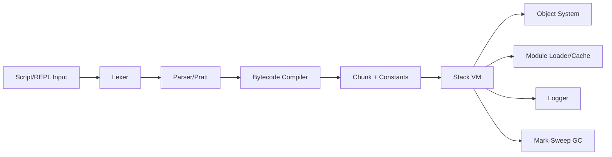
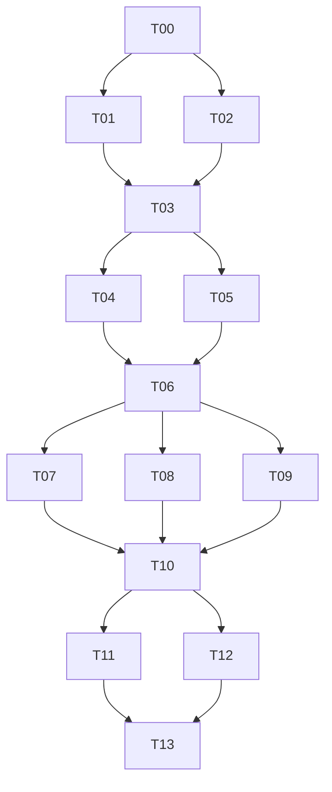

# Requirements.md

## 1. 背景与目标

Maple 是一个参考 Crafting Interpreters 中 clox 路线实现的脚本语言运行时项目，采用 C++23+ 构建。
目标是在保持 clox 核心语义与执行模型的基础上，实现工程化、可测试、跨平台（Windows/MSVC 与 Linux/GCC）的现代版本，并新增模块导入能力（`import` 与 `from ... import ... as ...`）。

核心目标：
1. 完整的字节码编译与栈式 VM 执行能力。
2. 可用的垃圾回收机制（GC），支持复杂对象图与闭包生命周期管理。
3. 模块系统与导入语义扩展。
4. 内部彩色分级日志系统。
5. 清晰的多文件工程结构、CMake 构建体系与独立测试目录。

## 2. 范围定义

### 2.1 In Scope

1. 词法分析、语法解析、字节码生成、虚拟机解释执行完整链路。
2. clox 等价核心语言能力：表达式、语句、控制流、函数、闭包、类与继承、方法调用、原生函数桥接。
3. GC（至少 mark-sweep，包含根集合追踪）。
4. Maple 模块系统（`import` 与 `from ... import ... as ...`）。
5. REPL 与脚本文件执行模式。
6. 跨平台构建与测试基线（MSVC/GCC）。
7. 内置 logger（分级、彩色、可配置）。

### 2.2 Out of Scope

1. JIT/AOT 编译。
2. 多线程 VM 与并发 GC。
3. 包管理器与远程模块仓库。
4. GUI 调试器。
5. 与 Python/JS 完全语义兼容。

## 3. 功能需求（按优先级）

### 3.1 P0（首版必须）

1. 语言核心：变量、作用域、条件、循环、函数、闭包、类、继承、方法绑定。
2. 字节码与 VM：指令执行、调用帧、栈管理、运行时错误报告。
3. GC：对象分配追踪、可达性标记、清扫回收、字符串驻留支持。
4. 文件执行与 REPL。
5. `import module`：模块加载、缓存、一次初始化。
6. `from module import name as alias`：符号导入与别名绑定。
7. Logger：`TRACE/DEBUG/INFO/WARN/ERROR/FATAL` 级别与颜色映射。
8. CMake 跨平台构建 + 基础测试集。

### 3.2 P1（首版后增强）

1. 模块循环依赖的显式诊断与部分初始化策略优化。
2. 更精确的报错定位（文件、行、列、调用栈）。
3. 可配置 GC 阈值与调试统计输出。
4. 快照测试与回归测试工具链统一。

### 3.3 P2（演进方向）

1. 字节码优化（常量折叠、窥孔优化）。
2. 增量 GC 预研接口。
3. 可插拔模块加载器。

## 4. 非功能需求

1. 可移植性：Windows 10+/11 + MSVC（19.3x+），Linux + GCC（13+）可构建运行。
2. 可维护性：模块化多文件结构，`.hh/.cc` 分离，`namespace ms` 统一。
3. 可观测性：日志分级、过滤、关键路径埋点（编译/执行/GC/模块加载）。
4. 性能：在教学可读性前提下保证线性可扩展。
5. 稳定性：非法脚本不导致宿主进程崩溃（除不可恢复错误）。

## 5. import 语义需求（精确定义）

1. `import foo.bar`
- 解析 `foo.bar` 为规范模块标识（可映射到路径）。
- 首次导入执行模块顶层代码并缓存模块对象。
- 重复导入返回缓存，不重复执行。

2. `from foo.bar import baz as qux`
- 导入时校验 `baz` 存在。
- 将 `baz` 绑定到当前作用域 `qux`。
- 未指定 `as` 时默认原名绑定。

3. 错误情形
- 模块不存在、符号不存在、循环依赖导致未初始化访问，均需明确错误类型与定位信息。

## 6. 测试需求

1. `tests/` 独立目录管理。
2. 覆盖：词法/语法/编译单测、VM 指令行为、GC 生命周期、模块导入语义与错误路径、REPL/CLI 集成、跨平台冒烟测试。
3. 测试脚本覆盖正常流、边界流、错误流、回归场景。

## 7. 里程碑与验收（DoD）

| 里程碑 | 交付物 | 验收标准 |
|---|---|---|
| M1 | 基础前端 + 字节码 + VM | 基础语句与函数测试通过 |
| M2 | 闭包/类/继承 + GC | 对象生命周期与闭包测试通过 |
| M3 | 模块系统 | 模块缓存、别名导入、错误路径测试通过 |
| M4 | Logger + 跨平台构建 + 测试完善 | Windows/Linux CI 通过 |

---

# Design.md

## 1. 总体架构



## 2. 关键设计决策

1. 编译期与运行时职责分离，降低耦合。
2. 采用 clox 风格单遍编译（Pratt + 直接生成字节码），首版不强依赖完整 AST。
3. GC 首版采用 mark-sweep。
4. 模块首版采用“源码级即时加载编译执行”，并引入模块缓存。
5. logger 采用轻量接口 + 平台适配层（ANSI/Windows 控制台）。

## 3. 推荐目录结构

```text
Maple/
  CMakeLists.txt
  cmake/
  src/
    main.cc
    cli/
      app.hh
      app.cc
    frontend/
      token.hh
      lexer.hh
      lexer.cc
      parser.hh
      parser.cc
      compiler.hh
      compiler.cc
    bytecode/
      opcode.hh
      chunk.hh
      chunk.cc
      disasm.hh
      disasm.cc
    runtime/
      value.hh
      object.hh
      object.cc
      table.hh
      table.cc
      vm.hh
      vm.cc
      gc.hh
      gc.cc
      module.hh
      module.cc
    support/
      logger.hh
      logger.cc
      source.hh
      source.cc
  tests/
    unit/
    integration/
    scripts/
      language/
      gc/
      module/
      cli/
```

---

# Task Decomposition (Multi-Agent Ready)

## 1. 拆分原则

1. 每个 Task 必须“单一目标 + 独立交付 + 可测试 + 可验证”。
2. 每个 Task 明确输入、输出、依赖、验收标准。
3. 支持并行：标注可并行组（Parallel Group）。
4. 每个 Task 应可由独立 agent/subagent 执行，减少跨文件强耦合。
5. 先搭骨架再填功能：基础设施 Task 优先。

## 2. 任务总览与依赖图



## 3. Task 清单（可执行、可测试、可验证）

### T00 - 工程初始化与约束落地（P0）

- Goal: 建立 CMake 工程骨架与目录结构，锁定 C++23、命名空间约束、文件后缀规范。
- Status: completed (2026-03-08)
- Inputs: PLAN.md、AGENTS.md。
- Outputs:
  - `CMakeLists.txt`
  - `src/`, `tests/`, `cmake/` 基础目录
  - 最小可编译空 target（`maple_core`, `maple_cli`）
- Depends On: 无
- Parallel Group: G0
- Test:
  - CMake configure 成功
  - 空程序可构建
- Verify:
  - `cmake -S . -B build`
  - `cmake --build build`
- DoD:
  - Windows/Linux 均可通过基础构建。

### T01 - 日志系统（P0）

- Goal: 实现 logger 等级、格式、颜色映射与平台适配接口。
- Status: completed (2026-03-08, subagent-A)
- Inputs: T00 骨架。
- Outputs:
  - `src/support/logger.hh/.cc`
  - 日志等级配置入口
- Depends On: T00
- Parallel Group: G1
- Test:
  - 单元测试：等级过滤、格式化、颜色开关
- Verify:
  - 执行 logger 测试，人工核对颜色输出
- DoD:
  - TRACE/DEBUG/INFO/WARN/ERROR/FATAL 均可输出且可过滤。

### T02 - 源文件与错误位置信息基础设施（P0）

- Goal: 实现源码装载、行列映射、统一错误位置信息结构。
- Status: completed (2026-03-08, subagent-A)
- Outputs:
  - `src/support/source.hh/.cc`
  - 统一错误位置数据结构
- Depends On: T00
- Parallel Group: G1
- Test:
  - 行列映射单测
  - 文件读取错误路径单测
- Verify:
  - 测试覆盖正常/异常读取

### T03 - 字节码容器与反汇编器（P0）

- Goal: 落地 opcode 定义、chunk 常量池、行号表、反汇编。
- Status: completed (2026-03-08, subagent-A)
- Outputs:
  - `src/bytecode/opcode.hh`
  - `src/bytecode/chunk.hh/.cc`
  - `src/bytecode/disasm.hh/.cc`
- Depends On: T01, T02
- Parallel Group: G2
- Test:
  - 指令写入/读取一致性
  - 常量池索引边界测试
  - 反汇编快照测试
- Verify:
  - 对固定 chunk 生成稳定反汇编文本

### T04 - 词法分析器（P0）

- Goal: 完成 token 定义与 lexer（包含关键字、字符串、数字、注释）。
- Status: completed (2026-03-08, subagent-B)
- Outputs:
  - `src/frontend/token.hh`
  - `src/frontend/lexer.hh/.cc`
- Depends On: T03
- Parallel Group: G3
- Test:
  - token golden tests（正常与非法输入）
- Verify:
  - `tests/unit/frontend/lexer_*`

### T05 - 值类型与对象系统基座（P0）

- Goal: 构建 `Value`、`Obj` 基类及字符串对象/哈希表基础。
- Status: completed (2026-03-08, subagent-C)
- Outputs:
  - `src/runtime/value.hh`
  - `src/runtime/object.hh/.cc`
  - `src/runtime/table.hh/.cc`
- Depends On: T03
- Parallel Group: G3
- Test:
  - Value 判型与比较
  - 字符串驻留与哈希表读写
- Verify:
  - 单测覆盖对象创建、查找、驻留复用

### T06 - VM 栈机最小闭环（P0）

- Goal: 最小指令集执行（常量、算术、比较、跳转、打印、返回）与调用栈基础。
- Status: completed (2026-03-08, subagent-C)
- Outputs:
  - `src/runtime/vm.hh/.cc`
- Depends On: T04, T05
- Parallel Group: G4
- Test:
  - 指令级单测
  - 小脚本集成测试（表达式/分支/循环）
- Verify:
  - 测试脚本返回码与输出匹配

### T07 - 解析器（Pratt）与表达式编译（P0）

- Goal: parser + compiler 完成表达式与基础语句到字节码生成。
- Status: completed (2026-03-08, subagent-B)
- Outputs:
  - `src/frontend/parser.hh/.cc`
  - `src/frontend/compiler.hh/.cc`
- Depends On: T06
- Parallel Group: G5
- Test:
  - 编译产物字节码快照
  - 语法错误诊断测试
- Verify:
  - 固定输入脚本输出固定反汇编

### T08 - 函数/闭包/upvalue（P0）

- Goal: 实现函数对象、调用帧、闭包捕获与 upvalue 生命周期。
- Status: completed (2026-03-08, clox-full-semantics-upgrade, closure-batch)
- Current State:
  - 已完成最小可运行桥接实现（baseline bridge），但尚未达到 clox 完整闭包语义。
  - 2026-03-08 补充了词法与运行时对象承载基础：`fun/return/class/this/super` 关键字和相关符号 token 已接入 lexer；`Value` 已支持通用运行时对象持有（`RuntimeObject`），为 closure/class 对象模型接入提供存储通道。
- Design & Implementation Tasks (No Code Yet):
  - `T08-D1` 对象模型补全：`ObjFunction / ObjClosure / ObjUpvalue`、函数原型、常量池与闭包对象关系。
  - `T08-D2` 编译器语义补全：局部变量解析、上值解析（递归向外层捕获）、函数声明/匿名函数、作用域深度与逃逸变量管理。
  - `T08-D3` VM 执行链补全：`OP_CALL`、`OP_CLOSURE`、`OP_GET_UPVALUE`、`OP_SET_UPVALUE`、`OP_CLOSE_UPVALUE`、`OP_RETURN` 与调用帧窗口。
  - `T08-D4` 运行时一致性：递归、闭包写回、循环捕获、返回后上值存活、错误栈追踪与消息格式。
  - `T08-D5` 测试矩阵：闭包 golden 脚本、递归/高阶函数、边界错误（参数个数、未定义变量、非法调用）与回归集合。
- Outputs:
  - `src/runtime/object.hh/.cc`（函数/闭包/upvalue 对象）
  - `src/runtime/vm.hh/.cc`（调用帧+upvalue 生命周期）
  - `src/frontend/compiler.hh/.cc`（闭包编译路径）
  - `tests/scripts/language/closure_*`
  - `tests/integration/closure_*`
- Depends On: T06
- Parallel Group: G5
- Test:
  - 闭包捕获（读/写）语义测试
  - 递归与高阶函数测试
  - 上值关闭时机测试（离开作用域后仍可访问）
- Verify:
  - 与 clox Chapter 24~26 同类样例行为一致（输出和错误路径一致）

### T09 - 类/继承/方法绑定（P0）

- Goal: 实现 class、instance、method、super 调用链。
- Status: completed (2026-03-08, clox-full-semantics-upgrade, class-inheritance-batch)
- Current State:
  - 已完成最小可运行桥接实现（baseline bridge），但尚未达到 clox 完整 class/inheritance 语义。
  - 2026-03-08 已完成类语义前置基础：新增 class 语法关键 token 与对象值通道，后续可在不破坏 `Value` ABI 的前提下落地 `ObjClass/ObjInstance/ObjBoundMethod` 与调用分派链。
- Design & Implementation Tasks (No Code Yet):
  - `T09-D1` 对象模型补全：`ObjClass / ObjInstance / ObjBoundMethod` 与字段表、方法表布局。
  - `T09-D2` 编译器语义补全：`class` 声明、方法编译、`this` 绑定规则、`super` 解析与继承约束（禁止自继承）。
  - `T09-D3` VM 指令链补全：`OP_CLASS`、`OP_INHERIT`、`OP_METHOD`、`OP_GET_PROPERTY`、`OP_SET_PROPERTY`、`OP_GET_SUPER`、`OP_INVOKE`、`OP_SUPER_INVOKE`。
  - `T09-D4` 运行时一致性：构造器 `init`、方法分派、绑定方法对象生命周期、字段遮蔽与覆盖解析顺序。
  - `T09-D5` 测试矩阵：类定义/实例字段/方法调用/继承覆盖/`super` 链/错误路径回归。
- Outputs:
  - `src/runtime/object.hh/.cc`（类/实例/绑定方法对象）
  - `src/runtime/vm.hh/.cc`（属性访问与调用分派）
  - `src/frontend/compiler.hh/.cc`（class/this/super 编译路径）
  - `tests/scripts/language/class_*`
  - `tests/integration/class_*`
- Depends On: T06
- Parallel Group: G5
- Test:
  - 类定义、字段读写、方法调用、继承覆盖测试
  - `this`/`super` 语义与错误路径测试
- Verify:
  - 与 clox Chapter 27~29 同类样例行为一致（输出和错误路径一致）

### T10 - GC（mark-sweep）接入（P0）

- Goal: 完整 GC 根扫描、标记、清扫、触发阈值与统计日志。
- Status: completed (2026-03-08, subagent-C)
- Outputs:
  - `src/runtime/gc.hh/.cc`
  - VM/对象系统 GC 钩子接入
- Depends On: T07, T08, T09
- Parallel Group: G6
- Test:
  - 压力分配回收测试
  - 闭包/类/字符串在回收中的存活测试
  - 回归：无悬垂引用
- Verify:
  - GC 日志统计与对象数量变化符合预期

### T11 - 模块系统：import（P0）

- Goal: 支持 `import module`，含路径解析、加载、编译执行、缓存。
- Status: completed (2026-03-08, subagent-D)
- Outputs:
  - `src/runtime/module.hh/.cc`
  - 编译器与 VM 的导入指令/调用路径
- Depends On: T10
- Parallel Group: G7
- Test:
  - 首次导入执行、重复导入缓存复用
  - 模块不存在错误
- Verify:
  - 模块顶层副作用只执行一次

### T12 - 模块系统：from import as（P0）

- Goal: 支持 `from a.b import x as y` 语义与错误处理。
- Status: completed (2026-03-08, subagent-D)
- Outputs:
  - parser/compiler/module/vm 对应扩展
- Depends On: T10
- Parallel Group: G7
- Test:
  - 导入符号绑定与别名绑定
  - 符号不存在错误
  - 循环依赖未初始化访问错误
- Verify:
  - 各语义脚本断言通过

### T13 - CLI/REPL + 测试总装 + 跨平台 CI（P0）

- Goal: 完整交付入口程序、测试目录、ctest 集成、跨平台验证脚本。
- Status: completed (2026-03-08, subagent-D)
- Outputs:
  - `src/main.cc`, `src/cli/app.hh/.cc`
  - `tests/unit`, `tests/integration`, `tests/scripts`
  - `CTest` 配置与最小 CI 脚本
- Depends On: T11, T12
- Parallel Group: G8
- Test:
  - CLI 参数测试
  - REPL 基本交互测试
  - 端到端脚本测试
- Verify:
  - `ctest --output-on-failure` 全通过
  - Windows/Linux 双平台构建与测试通过

## 4. 子任务模板（供多 Agent 复用）

每个子 Agent 必须按以下模板提交结果：

1. Task ID
2. 变更文件清单
3. 行为变更说明
4. 新增/更新测试
5. 本地验证命令与结果
6. 风险与后续建议

## 5. 并行执行建议（Agent 编排）

1. Wave 1: `T00`
2. Wave 2: `T01 + T02`（并行）
3. Wave 3: `T03`
4. Wave 4: `T04 + T05`（并行）
5. Wave 5: `T06`
6. Wave 6: `T07 + T08 + T09`（baseline）
7. Wave 6R: `T08-D1~D5 + T09-D1~D5`（clox 完整语义升级）
8. Wave 7: `T10`
9. Wave 8: `T11 + T12`（并行）
10. Wave 9: `T13`

## 6. 验收矩阵（Task -> 可验证产物）

| Task | 可执行 | 可测试 | 可验证 |
|---|---|---|---|
| T00 | CMake 可构建 | 构建冒烟 | configure/build 命令成功 |
| T01 | logger demo | 单元测试 | 等级过滤与颜色输出 |
| T02 | source loader demo | 单元测试 | 错误定位准确 |
| T03 | chunk/disasm demo | 单元+快照 | 反汇编稳定 |
| T04 | lexer CLI | 单元+golden | token 序列一致 |
| T05 | object/table demo | 单元测试 | 驻留与哈希行为稳定 |
| T06 | VM demo | 指令集成 | 脚本输出匹配 |
| T07 | compile demo | 编译快照 | 字节码一致 |
| T08 | closure demo | 集成测试 | 捕获语义正确 |
| T09 | class demo | 集成测试 | 继承与方法解析正确 |
| T10 | GC stress demo | 压测+回归 | 无泄漏/悬垂（以测试为准） |
| T11 | import demo | 集成测试 | 缓存复用、一次初始化 |
| T12 | from-import-as demo | 集成测试 | 别名绑定与错误路径正确 |
| T13 | CLI/REPL executable | 全量测试 | ctest + 双平台通过 |

## 7. 分支与提交策略（多 Agent）

1. 每个 Task 使用独立分支：`task/Txx-short-name`。
2. 每个 Task 至少一组“功能 commit + 测试 commit”（可合并为 1 个原子 commit）。
3. 提交信息必须英文，且包含 gitmoji（遵循 AGENTS.md）。
4. 合并顺序严格按依赖图，自底向上。

## 8. 风险控制点（执行期）

1. T08/T09 与 T10 的接口冻结点必须提前定义（防止 GC 接入返工）。
2. T11/T12 必须在 parser 语法与 VM 指令层对齐后再并行。
3. 任一 Task 若修改公共对象布局，必须触发受影响 Task 回归测试。

## 9. 完整交付判定

满足以下条件即视为 PLAN 对应功能“可实施且可验证”：

1. T00-T13 全部完成并通过定义测试，且 T08/T09 达到 clox 完整语义（闭包 + 类继承）。
2. tests 目录具备单元、集成、脚本测试分层。
3. `import` 与 `from ... import ... as ...` 覆盖正常与错误路径。
4. VM + GC + logger + 跨平台构建均有可复现实证。

## 2026-03-08 Incremental Update
- T08 status: completed (closure batch, D1~D5).
- T09 status: completed (class/inheritance batch).
- Verification: cmake --build build --config Debug; ctest --test-dir build --output-on-failure -C Debug.

- 2026-03-08 update: T09 class/inheritance batch completed with class_* integration scripts and tests.
