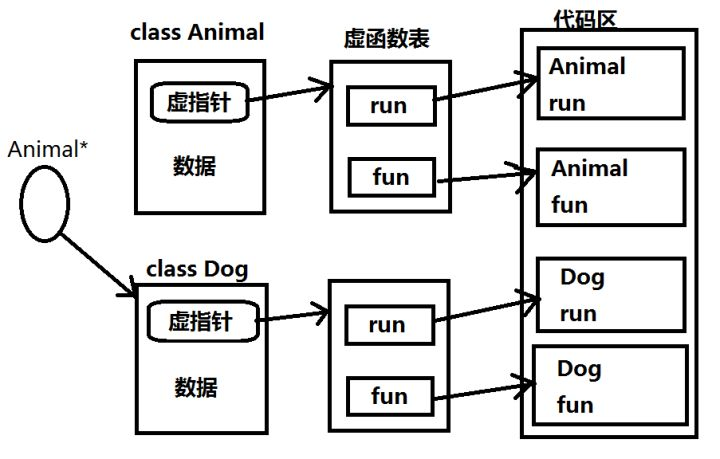

# **INTERVIEW**
***

## **1. C++多态**
  

  * 继承实现多态
  * 方法重载（参数类型和个数不同。。。）
  * 运算符重载实现多态
  * 抽象类和虚函数实现多态
  * 静态多态（一般时通过函数重载或模版实现，在编译期确定行为）；动态多态（通过虚函数等技术实现）
  * 虚析构函数的作用

  多态出现的方式（1、父类指针指向子类对象；2、父类引用作为子类别名）

## **右值**

## **2、问题**
  * 标准库的线程安全性
  * 如何避免内存泄漏，自动化对象生命期管理，智能指针，循环引用，`weak_ptr`；`enable_shared_from_this`是做什么的，应用场景呢？
  * list的insert、erase与vector相比那个快（需要分情况）
  * 内存泄漏？如何实现一个引用计数的指针，需要注意什么（侵入式、非侵入式）？自然过渡到python的引用计数？垃圾回收等。。。
  * STL迭代器失效（list、set、map插入时不失效，vector插入时扩容时可能失效；list、set、map删除时对应节点失效，vector删除时其后所有的节点失效）
  * tcp、udp；区别，什么时候用什么；accept等；select、poll
  * 进程、线程；区别、优势、什么时候用什么？线程同步？认为好的线程模型；
