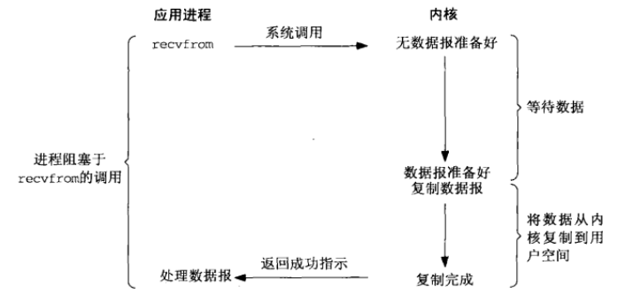
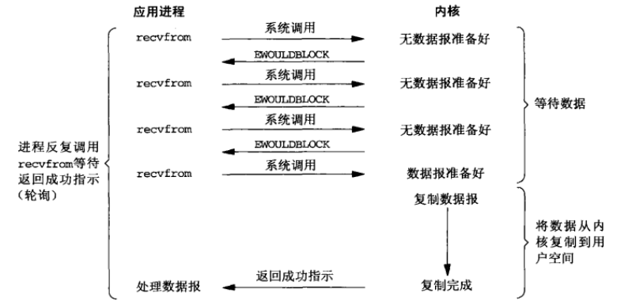
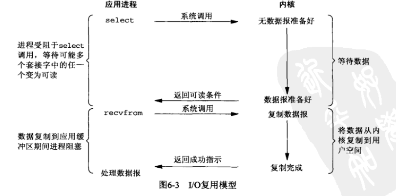
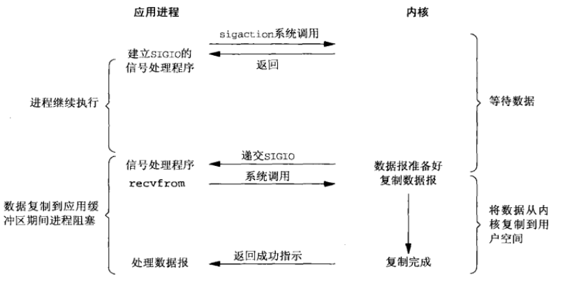
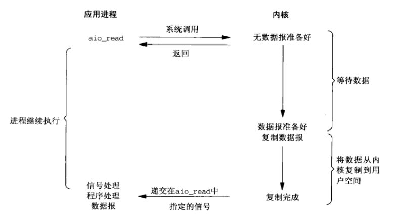
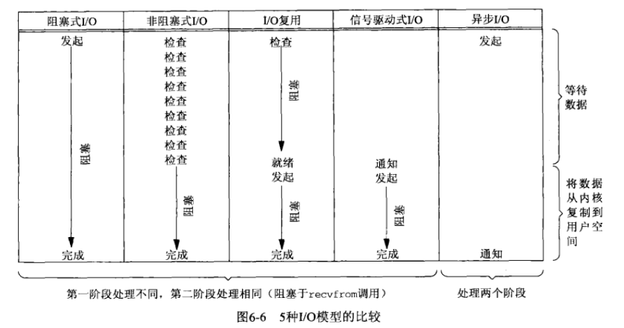

# **I/O复用: select和poll函数**
***

## **1. IO复用典型场合**
  * 客户处理多个描述符时
  * 一个客户同时处理多个套接字
  * 一个TCP服务器既要处理监听套接字, 又要处理已连接套接字
  * 一个服务器既要处理TCP又要处理UDP
  * 一个服务器要处理多个服务或多个协议
  * IO复用并非限制于网络编程，许多重要的应用程序也需要使用这个技术

## **2. IO模型**
    1) Unix下可用的IO模型:
        * 阻塞式IO
        * 非阻塞式IO
        * IO复用(select和poll)
        * 信号驱动式IO(SIGIO)
        * 异步IO(POSIX的aio_系列函数)
> ### **2.1 阻塞式IO模型**

    1) 默认所有套接字都是阻塞的
    2) 就UDP而言, 数据准备好就是: 要么整个数据报已经收到, 要么没有;
       对于recvfrom调用一般都会从应用进程空间中运行切换到在内核空间中运行，一段
       时间之后再切换回来。
    3) 进程调用recvfrom, 系统调用直到数据报到达且被复制到应用进程的缓存区
       或发生错误才返回; 常见错误是系统调用被信号终端，recvfrom返回成功后，应用
       进程开始处理数据报。
> ### **2.2 非阻塞式IO模型**

    1) 把一个套接字设置成非阻塞是通知内核:
        当所请求的IO操作非得把本进程放到睡眠才能完成时, 不要把本进程投入
        睡眠, 而是返回一个错误;
    2) 一个应用对一个非阻塞描述符循环调用recvfrom时, 就是轮询; 应用进程持续轮询
       内核，以查看某个操作是否就绪。
> ### **2.3 IO复用模型**

    1) 调用select或poll, 阻塞在这两个系统调用之上, 而不是阻塞在真正的IO调
       用之上;
    2) 阻塞与select或poll上, 等待数据报套接字变为可读; 当select返回套接字可读
       这个条件时, 再调用recvfrom将所读数据复制到进程缓存区;
> ### **2.4 信号驱动式IO模型**

    1) 用信号, 让内核在描述符就绪的时候发送SIGIO信号通知我们;
    2) 开启套接字的信号驱动式IO功能, 并安装一个信号处理函数; 该函数立即返
       回, 我们继续工作; 当有数据准备好之后, 系统产生一个SIGIO信号, 然后
       我们再处理...
       我们可以在信号处理函数中调用recvfrom读取数据，并通知主循环数据已准备号待
       处理，也可以立即通知主循环，让它读取数据。
    3) 该模式的优势在于等待数据到达期间进程不会阻塞，主循环可以继续执行，只要等
       待来自信号处理函数的通知然后处理即可。
> ### **2.5 异步IO模型**

    1) 告知内核启动某个操作, 并让内核在真个操作完成后通知我们;
    2) 和信号驱动式的区别是:
        * 信号驱动式是由内核通知我们何时可以启动一个IO操作;
        * 异步IO是内核通知我们IO操作何时完成;
> ### **2.6 同步IO和异步IO**

    1) 同步IO操作导致请求进程阻塞，直到IO操作完成
    2) 异步IO操作不导致请求进程阻塞

## **3. select函数**
        #include <sys/select.h>
        #include <sys/time.h>
        int select(int maxfdp1, fd_set* readset, fd_set* writeset,
            fd_set* exceptset, const struct timeval* timeout);
            => 若有就绪描述符则为其数目, 若超时返回0, 出错返回-1
    1) 允许进程指示内核等待多个事件中任何一个发生, 并只在有一个或多个事件发
       生或经历一段指定的时间后才唤醒它;
    2) 调用select告知内核对哪些描述符感兴趣以及等待多长时间;
    3) 对于timeout参数:
        timeval结构用于指定这段时间的秒数和微秒数。
        struct timeval {
          long tv_sec;
          long tv_usec;
        };
        * 永远等下去, 仅在有一个描述符准备好IO时才返回; 需要将参数设为NULL;
        * 等待一段固定时间, 在有一个描述符准备好IO时返回, 但不超过该参数指向
          timeval结构中指定的秒数和微秒数。
        * 不等待: 检查后立即返回(轮询); timeout参数的秒和微秒必须为0;
        尽管timeval允许指定一个微秒级别的分辨率，但是内核支持的真实分辨率粗糙
        很多，Unix往往会将超时向上舍入10ms的倍数。
    4) select的中间3个参数, 如果我们不感兴趣可以直接设置为NULL; 如果三个指针参数
       都为空，就是一个比Unix的sleep更为精确的定时器。
    5) maxfdp1指定待测试的描述符个数, 是待测试的最大描述符加1;
    6) 目前支持的异常只有两个：
        * 某个套接字的带外数据的到达。
        * 某个已置为分组模式的伪终端存在可从其主端读取的控制状态信息。
    7) 调用时我们指定所关心的描述符的值，返回时，结果指示哪些描述符已经就绪；我
       们可以使用FD_ISSET来测试fd_set数据类型中的描述符。
    8) select返回表示跨所有描述符集的已就绪的总位数，如果在任何描述符就绪之前的
       定时器到时，返回0；返回-1表示出错。
> ### **3.1 描述符就绪条件**
    1) 套接字准备好读的条件:
        * 该套接字接收缓冲区的数据字节大于等于套接字接收缓存区低水位标记的当
          前大小;
          对这样的套接字执行读操作不会阻塞并将返回一个大于0的值，可以使用SO_RCVLOWAT
          设置该套接字的低水位标记；对TCP和UDP而言，默认值是1。
        * 该连接的读半步关闭(接收了FIN的TCP连接);
          对这样的套接字的读操作将不阻塞并返回0。
        * 该套接字是一个监听套接字且已完成的连接数不为0;
          对这样的套接字执行accept不会阻塞。
        * 其上有一个套接字错误等待处理;
          对这样的套接字的读操作不阻塞并返回-1，同时将errno设置为确切的错误条件。
          这些待处理错误也可通过指定SO_ERROR选项调用getsockopt获取并清除。
    2) 套接字准备好写的条件:
        * 该套接字发送缓冲区的可用空间大于等于套接字发送缓存区低水位标记的当
          前大小, 或者该套接字已连接, 或该套接字不需要连接;
          将这样的套接字设置位非阻塞，写操作将不阻塞并返回一个正值。
          可以使用SO_SNDLOWAT来设置低水位标记, 对TCP和UDP默认是2048;
        * 该连接的写半部关闭; 对其的写操作会产生SIGPIPE信号。
        * 使用非阻塞connect的套接字已建立连接, 或connect已经以失败告终;
        * 其上有一个套接字错误等待处理;
          对这样的套接字执行写操作不会阻塞将会返回-1，同时将errno设置为确切的错
          误条件，这些待处理错误也可通过SO_ERROR套接字选项调用getsockopt获取并清除。
    3) 如果一个套接字存在带外数据或仍处于带外标记, 那么它有异常等待处理;
       接收低水位标记和发送低水位标记的目的在于：允许应用进程控制在select返回可
       读或可写条件之前有多少数据可读或有多大空间可用于写。
    4) 任何UDP套接字只要其发送低水位标记小于等于发送缓冲区大小就总是可写的，这是
       由于UDP套接字不需要连接。
    5) 总结如下:
        * 有数据可读                => 可读
        * 关闭连接读一半            => 可读
        * 给监听套接口准备好新连接  => 可读
        * 有可用于写的空间          => 可写
        * 关闭连接的写一半          => 可写
        * 待处理错误                => 可读, 可写
        * TCP带外数据               => 异常

## **4. shutdown函数**
    1) close函数的限制:
        * 将描述符的引用计数减1, 仅在计数变为0的时候才关闭套接字; 使用shutdown
          可不管引用计数就激发TCP的正常连接终止序列。
        * close终止读和写两个方向的数据传送; TCP连接是全双工的，我们需要告知对
          端我们已经完成数据发送，即使对端仍有数据要发送给我们。
    2) shutdown
        #include <sys/socket.h>
        int shutdown(int sockfd, int howto);  => 返回: 成功返回0, 否则返回-1
    3) howto参数的取值:
        * SHUT_RD => 关闭连接的读一半, 套接字中不再有数据可接收, 而套接字接
          收缓冲区中的现有数据被丢弃; 不能再对进行任何读操作;
          对一个TCP套接字调用shutdown后，由该套接字接收的来自对端的任何数据都被
          确认，然后悄然丢弃。
        * SHUT_WR => 关闭连接的写一半; 这就是半关闭; 套接字发送缓冲区的数据
          被发送掉, 后跟TCP的正常连接终止序列; 不能再进行任何写操作;
        * SHUT_RDWR => 连接的读半部和写半部都关闭; 等效于调用2次shutdown，一次
          指定SHUT_RD，一次指定SHUT_WR。

## **5. pselect函数**
        #include <sys/select.h>
        #include <signal.h>
        #include <time.h>
        int pselect(int maxfdp1, fd_set* readset, fd_set* writeset,
            fd_set* exceptset, const struct timespec* timeout,
            const sigset_t* sigmask);
            => 若有就绪描述符返回其数目, 超时返回0, 出错返回-1
    1) 相对select的变换：
        * 使用timespec结构而不是timeval, 可精确到纳秒
        * pselect增加了第6个参数：一个指向信号掩码的指针

## **6. poll函数**
        #include <poll.h>
        int poll(struct pollfd* fdarray, unsigned long nfds, int timeout);
            => 若有就绪描述符则为其数目, 超时返回0, 出错返回-1
    1) 提供的功能与poll类似，不过在处理流设备时，提供额外的信息
    2) 第一个参数是一个pollfd结构的数组
        struct pollfd {
          int fd;
          short events;
          short revents;
        };
        要测试的成员由events指定，函数在相应的revents中返回该描述符的状态;
    3) poll的events和revents
        POLLIN: 可输入可结果; 普通或优先级带数据可读
        POLLRDNORM: 可输入可结果; 普通数据可读
        POLLRDBAND: 可输入可结果; 优先带数据可读
        POLLPRI: 可输入可结果; 高优先级数据可读
        POLLOUT: 可输入可结果; 普通数据可写
        POLLWRNORM: 可输入可结果; 普通数据可写
        POLLWRBAND: 可输入可结果; 优先级带数据可写
        POLLERR: 可结果; 发生错误
        POLLHUP: 可结果; 发生挂起
        POLLNVAL: 可结果; 描述符不是一个打开的文件
    4) poll识别3类数据: 普通，优先级带和高优先级
    5) TCP和UDP，以下条件poll返回特定revent
        * 所有正规TCP数据和所有UDP数据都被认为是普通数据
        * TCP的带外数据被认为是优先级带数据
        * 当TCP的读半部关闭时，也认为是普通数据，随后读操作返回0
        * TCP连接存在错误即可认为是普通数据，也可认为是错误，随后的读返回-1
        * 监听套接字上有新连接既可认为是普通数据，也可认为是优先级数据
        * 非阻塞式connect完成被认为是使相应套接字可写

## **7. 小结**
    1) 不同的IO模型：
        * 阻塞式IO模型
        * 非阻塞式IO模型
        * IO复用模型
        * 信号驱动式IO模型
        * 异步IO模型
    2)  默认是阻塞式IO模型，它是最常用的IO模型
    3) IO复用模型最常用的函数是select
