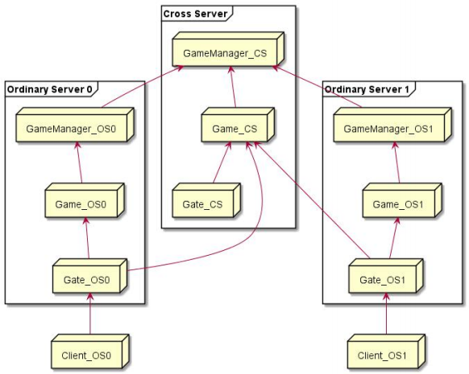
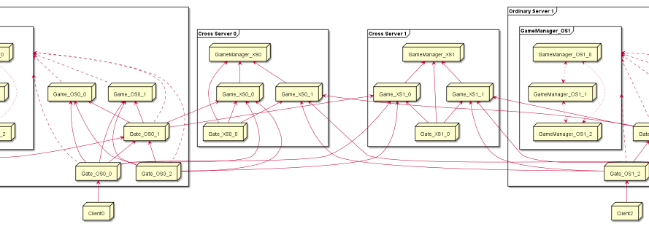

# 服务器架构介绍

---

# 目录
- 服务器架构演化简介
- Messiah服务器架构简介
- 其他架构设计

---

# 第一代游戏服务器

- 1978年，英国埃塞克斯大学的学生Roy Trubshaw编写了世界上第一个MUD程序MUD1
- 1980年，埃塞克斯大学接入ARPAnet，MUD1源码在ARPAnet共享，衍生出众多MUD版本
- 1991年，MusOS开源，成为众多网游的鼻祖

---

- 网游脱离文字MUD，进入图形化时代

---

- 网游脱离文字MUD，进入图形化时代
- 玩家增加，上下线需要频繁读写玩家数据

---

- 网游脱离文字MUD，进入图形化时代
- 玩家增加，上下线需要频繁读写玩家数据
- 数据增加，服务器开始无法承担读写重负

---

- 网游脱离文字MUD，进入图形化时代
- 玩家增加，上下线需要频繁读写玩家数据
- 数据增加，服务器开始无法承担读写重负
- 早期的EXT磁盘分区在停电的情况下容易发生数据丢失

---

# 第二代游戏服务器（1）

- 拆分文件存储到数据库
- 采用更灵活的Python或Lua替换LPC

---

- 随着游戏内容增加，单服结构开始成为瓶颈

---

- 随着游戏内容增加，单服结构开始成为瓶颈
- 玩家数量增加，单服结构开始无法承载，成为瓶颈

---

# 第二代游戏服务器（2）

- 根据游戏内容，不同的世界分布在不同的服务器上
- 多个服务器，分担了玩家和游戏内容的压力

---

- 多服务器同时访问数据库，服务器压力上升

---

- 多服务器同时访问数据库，服务器压力上升
- 数据库产生大量重复访问、大量数据交换

---

- 多服务器同时访问数据库，服务器压力上升
- 数据库产生大量重复访问、大量数据交换
- 数据库访问、读写成为瓶颈

---

# 如何解决？

---

**计算机科学领域的任何问题都可以通过增加一个间接的中间层来解决。**

---

# 第二代游戏服务器（3）

- 游戏服务器访问数据库代理
- 数据库代理访问数据库
- 数据库代理可提供内存级Cache，提升性能

---

- 玩家切换场景需要经常切换连接，中间状态容易出错

---

- 玩家切换场景需要经常切换连接，中间状态容易出错
- 游戏服务器多了之后，相互之间数据交互很麻烦

---

# 第二代游戏服务器（4）

- 拆分网络功能，独立出网关
- 玩家连接网关，再转发到后端的游戏服务器
- 玩家切换场景，不再需要重新连接，能提供更为稳定的服务

---

# 第二代游戏服务器（5）

- 通用的模块拆分出独立的服务
- 减轻游戏服务器的压力

---

- WOW开始无缝世界开始深入人心
- 每次切换场景Loading的等待破坏游戏体验

---

# 第三代游戏服务器（1）

- 每个Zone服务器管理一块地图区域
- ZoneMgr为它们提供整体的管理
- World层次的服务器提供大陆级别的管理服务
- 每个区域独自控制各自区域的玩家
- 处于两个区域边缘的玩家则同时由2个区域共同控制，直到离开边界很远才有其区域独自管理

---

- 很多区域服务器需要和玩家通信，需要向ZoneMgr查询指定uid的玩家在哪个对于的Gate

---

- 很多区域服务器需要和玩家通信，需要向ZoneMgr查询指定uid的玩家在哪个对于的Gate
- 由于玩家在各区域间切换，根据uid查找玩家很麻烦

---

- 很多区域服务器需要和玩家通信，需要向ZoneMgr查询指定uid的玩家在哪个对于的Gate
- 由于玩家在各区域间切换，根据uid查找玩家很麻烦
- Gate需要动态根据坐标等计算和哪些Zone通信，导致Gate逻辑越来越复杂

---

# 第三代游戏服务器（2）

- 玩家逻辑由按照uid划分的Obj服务器来承担
- Gate按网络负载来划分，Obj由uid来划分
- Zone专注场景，Obj专注玩家对象，Gate专注网络

---

# Messiah服务器

- Gate隔离外网增加安全性，提供加解密、广播、Game间消息转发
- 场景（进程）间迁移方便
- 负载均衡
- 扩容方便

---

# 再看看单服结构

---

# 单服中所有对象直接访问

---

# Messiah中的对象抽象（对象虚拟化）

- 对象（entity）可以创建在任意game上
- 对象之间使用消息交互

---

# Stub
- Stub中数据集中
- 逻辑处理方便，开发简单
- 成为单点性能瓶颈
- 单点故障，将影响所有玩家

---

# Messiah中的对象抽象（sharding）

- 分shard缓解了单点故障的影响
- 不同功能的stub分布在不同的game上，某个game故障时，只影响部分功能

---

# Messiah跨服结构

- 同一组服务器内迁移和多组服务器之间迁移没有本质上的区别
- 对玩家透明
- 普通服务器（OrdinaryServer）：玩家登录创建，进行普通单服玩法时所在的服务器
- 跨服服务器（CrossServer）：允许多个普通服玩法在此服务器上共同进行跨服玩法的服务器

---

# 全球同服开房间战斗？

---

# Messiah单服结构的连接

---

# Messiah单服结构

- 超大规模大集群连接数爆炸
- GameManager负载高
- 场内逻辑和场外逻辑混合
- 进程crash风险不可控

---

# Messiah跨服结构的连接

---

# 再看看复杂的Messiah跨服结构呢？

- MMO跨服
- Gate连接数多
- 跨服Gate利用率低

---

# 其他开房间游戏架构（棋牌游戏）

---

# 其他开房间游戏架构（跨集群结构）

---

# 其他开房间游戏架构（跨集群结构）
- 每个“服务器”都是独立的MessiahServer（MobileServer）
- 多个小的战斗服可动态水平扩展
- 集群内扩展不需要增加Gate连接数
- 同时连接大厅和匹配到的战斗服
- 无迁移

---

# 跨集群匹配

---

# 跨集群就更好吗？

---

# END
