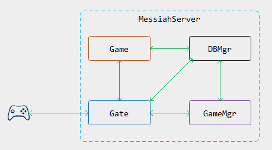

# 服务器架构介绍

---

# 目录
- 服务器架构演化简介
- Messiah服务器架构简介
- 其他架构设计

---

# 第一代游戏服务器

- 1978年，英国埃塞克斯大学的学生Roy Trubshaw编写了世界上第一个MUD程序MUD1
- 1980年，埃塞克斯大学接入ARPAnet，MUD1源码在ARPAnet共享，衍生出众多MUD版本
- 1991年，MusOS开源，成为众多网游的鼻祖

---

# 遇到的问题
- 网游脱离文字MUD，进入图形化时代
- 玩家增加，上下线需要频繁读写玩家数据
- 数据增加，服务器开始无法承担读写重负
- 早期的EXT磁盘分区在停电的情况下容易发生数据丢失

---

# 第二代游戏服务器（1）

- 拆分文件存储到数据库
- 采用Python或Lua替换LPC

---

# 遇到的问题
- 游戏内容增加，单服结构成为瓶颈
- 玩家数量增加，单服也成为承载瓶颈

---

# 第二代游戏服务器（2）

---

# 遇到的问题
- 多服务器同时访问数据库
- 大量重复访问
- 大量数据交换
- 数据库成为瓶颈

---

# 第二代游戏服务器（3）

- 服务器访问代理
- 代理访问数据库
- 提供内存级Cache

---

# 遇到的问题
- 切换场景导致切换连接
- 中间状态易出错
- 数据交换麻烦

---

# 第二代游戏服务器（4）

---

# 第二代游戏服务器（5）

---

# 第三代游戏服务器（1）

---

# 第三代游戏服务器（2）

---

# Messiah服务器架构

---

# Messiah跨服结构

---

# 其他架构
- 棋牌游戏

