# 服务器架构介绍

---

# 目录
- 服务器架构演化简介
- Messiah服务器架构简介
- 其他架构设计

---

# 第一代游戏服务器
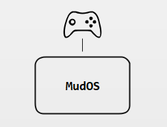

- 1978年，英国埃塞克斯大学的学生Roy Trubshaw编写了世界上第一个MUD程序MUD1
- 1980年，埃塞克斯大学接入ARPAnet，MUD1源码在ARPAnet共享，衍生出众多MUD版本
- 1991年，MusOS开源，成为众多网游的鼻祖

---

- 网游脱离文字MUD，进入图形化时代

---

- 网游脱离文字MUD，进入图形化时代
- 玩家增加，上下线需要频繁读写玩家数据

---

- 网游脱离文字MUD，进入图形化时代
- 玩家增加，上下线需要频繁读写玩家数据
- 数据增加，服务器开始无法承担读写重负

---

- 网游脱离文字MUD，进入图形化时代
- 玩家增加，上下线需要频繁读写玩家数据
- 数据增加，服务器开始无法承担读写重负
- 早期的EXT磁盘分区在停电的情况下容易发生数据丢失

---

# 第二代游戏服务器（1）
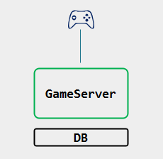

- 拆分文件存储到数据库
- 采用更灵活的Python或Lua替换LPC

---

- 随着游戏内容增加，单服结构开始成为瓶颈

---

- 随着游戏内容增加，单服结构开始成为瓶颈
- 玩家数量增加，单服结构开始无法承载，成为瓶颈

---

# 第二代游戏服务器（2）
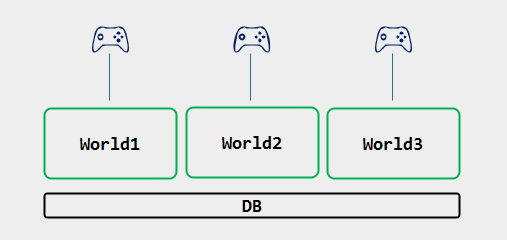

- 根据游戏内容，不同的世界分布在不同的服务器上
- 多个服务器，分担了玩家和游戏内容的压力

---

- 多服务器同时访问数据库，服务器压力上升

---

- 多服务器同时访问数据库，服务器压力上升
- 数据库产生大量重复访问、大量数据交换

---

- 多服务器同时访问数据库，服务器压力上升
- 数据库产生大量重复访问、大量数据交换
- 数据库访问、读写成为瓶颈

---

# 如何解决？

---

**计算机科学领域的任何问题都可以通过增加一个间接的中间层来解决。**

---

# 第二代游戏服务器（3）
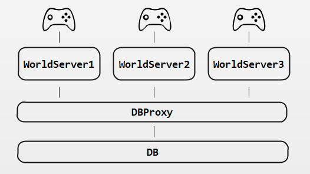

- 游戏服务器访问数据库代理
- 数据库代理访问数据库
- 数据库代理可提供内存级Cache，提升性能

---

- 玩家切换场景需要经常切换连接，中间状态容易出错

---

- 玩家切换场景需要经常切换连接，中间状态容易出错
- 游戏服务器多了之后，相互之间数据交互很麻烦

---

# 第二代游戏服务器（4）
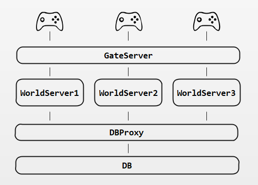

- 拆分网络功能，独立出网关
- 玩家连接网关，再转发到后端的游戏服务器
- 玩家切换场景，不再需要重新连接，能提供更为稳定的服务

---

# 第二代游戏服务器（5）
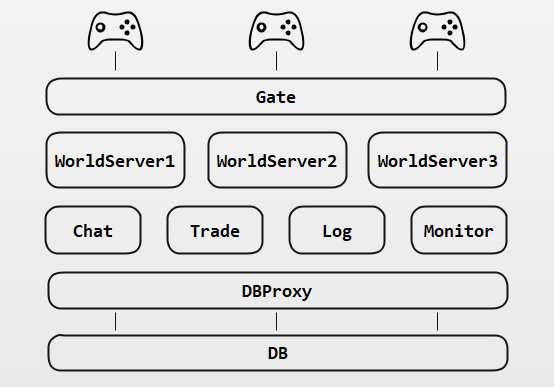

- 通用的模块拆分出独立的服务
- 减轻游戏服务器的压力

---

- WOW开始无缝世界开始深入人心
- 每次切换场景Loading的等待破坏游戏体验

---

# 第三代游戏服务器（1）

- 每个Zone服务器管理一块地图区域
- ZoneMgr为它们提供整体的管理
- World层次的服务器提供大陆级别的管理服务
- 每个区域独自控制各自区域的玩家
- 处于两个区域边缘的玩家则同时由2个区域共同控制，直到离开边界很远才有其区域独自管理

---

- 很多区域服务器需要和玩家通信，需要向ZoneMgr查询指定uid的玩家在哪个对于的Gate

---

- 很多区域服务器需要和玩家通信，需要向ZoneMgr查询指定uid的玩家在哪个对于的Gate
- 由于玩家在各区域间切换，根据uid查找玩家很麻烦

---

- 很多区域服务器需要和玩家通信，需要向ZoneMgr查询指定uid的玩家在哪个对于的Gate
- 由于玩家在各区域间切换，根据uid查找玩家很麻烦
- Gate需要动态根据坐标等计算和哪些Zone通信，导致Gate逻辑越来越复杂

---

# 第三代游戏服务器（2）
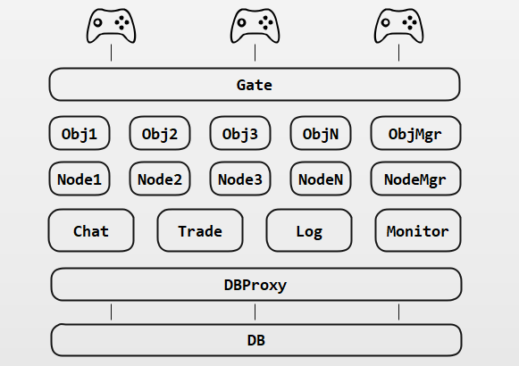

- 玩家逻辑由按照uid划分的Obj服务器来承担
- Gate按网络负载来划分，Obj由uid来划分
- Zone专注场景，Obj专注玩家对象，Gate专注网络

---

# Messiah服务器架构
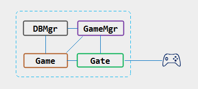

---

# Messiah跨服结构
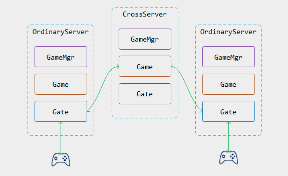

---

# 回头看看单服结构
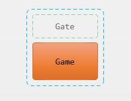

---

# 单服中所有对象直接访问

---

# Messiah中的对象抽象（对象虚拟化）
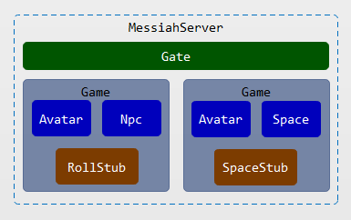

---

# Messiah中的对象抽象（分shard）
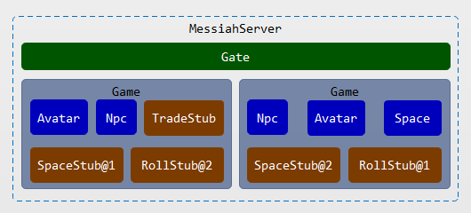

---

# 其他架构
* 棋牌游戏
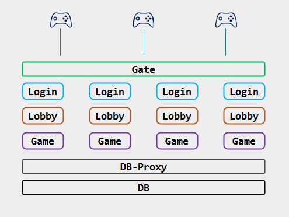

---

# 其他架构
* 跨集群机构
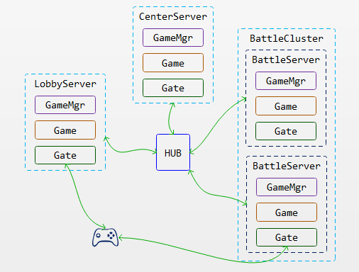

---

# 跨集群匹配架构
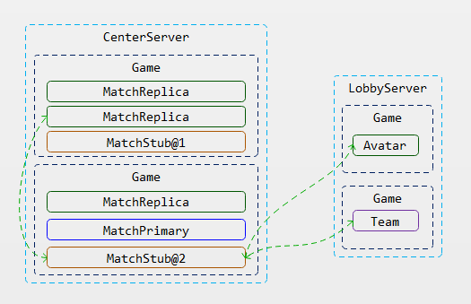

